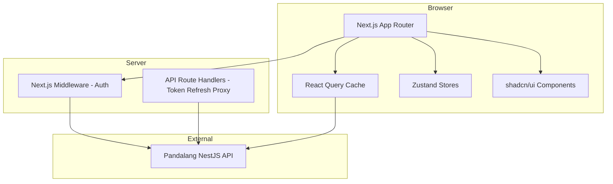

# Pandalang Frontend — Project Overview

## 1. Vision

**Pandalang Frontend** is the web client for the Pandalang EdTech SaaS platform. It provides a modern, responsive interface for all four actor roles (Super Admin, Tenant Admin, Instructor, Student) to interact with the Pandalang backend API.

The frontend is a **Next.js 16 App Router** application using **Tailwind CSS v4 + shadcn/ui** for the design system, **TanStack React Query** for server state, and **Zustand** for client state.

### Product Context

- **Domain**: Chinese language learning (expandable to other languages)
- **Model**: Multi-tenant SaaS — each school/institution gets their own branded experience
- **Users**: Students learning Chinese, Instructors creating courses, Tenant Admins managing schools, Super Admins managing the platform

## 2. MVP Scope

### In Scope (MVP)

| Area | Features |
|------|----------|
| **Authentication** | Login, Register, Logout, Token refresh, Protected routes |
| **Student Dashboard** | My enrollments, course progress, continue learning |
| **Course Catalog** | Browse published courses, course detail, enroll |
| **Learning Experience** | Lesson viewer (text/video/audio), lesson completion tracking |
| **Quiz Taking** | Take quizzes, view results, attempt history |
| **Progress Tracking** | Visual progress bars, completion status |
| **Instructor Dashboard** | My courses, create/edit courses, manage content |
| **Course Builder** | Section/lesson/quiz CRUD with drag-and-drop ordering |
| **Student Progress View** | Instructor views enrolled students and their progress |
| **Tenant Admin Panel** | User management, role assignment, tenant settings |
| **Super Admin Panel** | Tenant management, platform overview |

### Out of Scope (Post-MVP)

| Area | Deferred To |
|------|-------------|
| Payment/Checkout | Phase 2 |
| Certificate Generation | Phase 2 |
| Email Notifications UI | Phase 2 |
| File Upload (media) | Phase 2 |
| Analytics Dashboard | Phase 2 |
| Learning Paths | Phase 3 |
| Gamification UI | Phase 3 |
| Mobile-optimized PWA | Phase 3 |
| Real-time Features | Phase 3 |
| i18n / Localization | Phase 2 |

## 3. Architecture Overview

### Key Architecture Decisions

| Decision | Choice | Rationale |
|----------|--------|-----------|
| **Framework** | Next.js 16 App Router | Server components, middleware auth, file-based routing, React 19 |
| **Styling** | Tailwind CSS v4 + shadcn/ui | Utility-first CSS, accessible component primitives, full customization |
| **Server State** | TanStack React Query v5 | Caching, background refetch, optimistic updates, devtools |
| **Client State** | Zustand v5 | Lightweight, no boilerplate, TypeScript-first, middleware support |
| **Forms** | React Hook Form + Zod | Performant forms, schema-based validation matching API DTOs |
| **HTTP Client** | Fetch API wrapper (ky or custom) | Native fetch, interceptors for auth headers and token refresh |
| **Auth Strategy** | JWT in memory + httpOnly refresh cookie proxy | Secure token storage, automatic refresh via Next.js API route |
| **Routing** | App Router with middleware guards | Server-side auth checks, role-based redirects |

## 4. Actors & Their Primary Views

| Actor | Primary Views |
|-------|--------------|
| **Super Admin** | Tenant list, Create tenant, Tenant detail, Platform health |
| **Tenant Admin** | User list, Create user, Role management, Tenant settings, Course overview |
| **Instructor** | My courses, Course builder, Section/Lesson/Quiz editor, Student progress |
| **Student** | Course catalog, Course detail, Lesson viewer, Quiz taker, My enrollments, Progress dashboard |

## 5. API Integration

The frontend consumes the Pandalang NestJS REST API documented in [`api-docs.json`](../api-docs.json).

- **Base URL**: Configurable via `NEXT_PUBLIC_API_URL` environment variable
- **Auth**: JWT Bearer token in Authorization header
- **Tenant**: `x-tenant-id` header on all requests
- **Versioning**: All endpoints prefixed with `/api/v1`
- **Response Format**: `{ success: true, data: ..., meta: { timestamp, requestId } }`
- **Pagination**: `{ success: true, data: [...], meta: { page, limit, total, totalPages } }`
