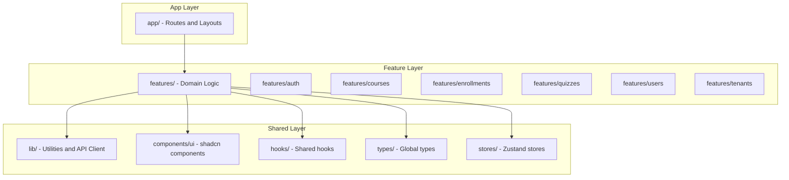

# Pandalang Frontend — Project Structure

## 1. Architecture Pattern

The project follows a **feature-based organization** with clear separation between:
- **App Router pages** (`app/`) — Routes, layouts, loading/error states
- **Features** (`features/`) — Domain logic grouped by feature (auth, courses, etc.)
- **Shared** (`lib/`, `components/`, `hooks/`, `types/`) — Cross-cutting concerns



## 2. Directory Structure

```
├── app/                                    # Next.js App Router
│   ├── (auth)/                             # Auth layout group (no sidebar)
│   │   ├── login/
│   │   │   └── page.tsx
│   │   ├── register/
│   │   │   └── page.tsx
│   │   └── layout.tsx                      # Centered card layout
│   │
│   ├── (dashboard)/                        # Dashboard layout group (with sidebar)
│   │   ├── layout.tsx                      # Sidebar + header + main content
│   │   │
│   │   ├── dashboard/                      # Role-aware dashboard home
│   │   │   └── page.tsx
│   │   │
│   │   ├── courses/                        # Course catalog & management
│   │   │   ├── page.tsx                    # Course list (catalog for students, management for instructors)
│   │   │   ├── [courseId]/
│   │   │   │   ├── page.tsx               # Course detail
│   │   │   │   ├── edit/
│   │   │   │   │   └── page.tsx           # Course editor (instructor/admin)
│   │   │   │   ├── sections/
│   │   │   │   │   └── [sectionId]/
│   │   │   │   │       └── lessons/
│   │   │   │   │           └── [lessonId]/
│   │   │   │   │               └── page.tsx  # Lesson viewer
│   │   │   │   ├── quizzes/
│   │   │   │   │   └── [quizId]/
│   │   │   │   │       └── page.tsx       # Quiz taker
│   │   │   │   └── enrollments/
│   │   │   │       └── page.tsx           # Course enrollments (instructor view)
│   │   │   └── new/
│   │   │       └── page.tsx               # Create new course
│   │   │
│   │   ├── enrollments/                    # Student enrollments
│   │   │   └── page.tsx                    # My enrollments list
│   │   │
│   │   ├── users/                          # User management (admin)
│   │   │   ├── page.tsx                    # User list
│   │   │   ├── [userId]/
│   │   │   │   └── page.tsx               # User detail
│   │   │   └── new/
│   │   │       └── page.tsx               # Create user
│   │   │
│   │   ├── tenants/                        # Tenant management (super admin)
│   │   │   ├── page.tsx                    # Tenant list
│   │   │   ├── [tenantId]/
│   │   │   │   └── page.tsx               # Tenant detail/settings
│   │   │   └── new/
│   │   │       └── page.tsx               # Create tenant
│   │   │
│   │   ├── settings/                       # User settings
│   │   │   └── page.tsx                    # Profile settings
│   │   │
│   │   └── loading.tsx                     # Dashboard-wide loading skeleton
│   │
│   ├── api/                                # Next.js API Routes (BFF proxy)
│   │   └── auth/
│   │       └── refresh/
│   │           └── route.ts               # Token refresh proxy
│   │
│   ├── layout.tsx                          # Root layout (providers, fonts)
│   ├── globals.css                         # Tailwind + CSS variables
│   ├── not-found.tsx                       # 404 page
│   └── error.tsx                           # Global error boundary
│
├── components/                             # Shared components
│   ├── ui/                                 # shadcn/ui components (auto-generated)
│   │   ├── button.tsx
│   │   ├── card.tsx
│   │   ├── dialog.tsx
│   │   ├── input.tsx
│   │   ├── ... (all shadcn components)
│   │   └── index.ts                        # Barrel export
│   │
│   ├── layout/                             # Layout components
│   │   ├── sidebar.tsx                     # Dashboard sidebar navigation
│   │   ├── header.tsx                      # Dashboard header with user menu
│   │   ├── mobile-nav.tsx                  # Mobile navigation drawer
│   │   └── breadcrumbs.tsx                 # Breadcrumb navigation
│   │
│   ├── shared/                             # Reusable business components
│   │   ├── data-table.tsx                  # Generic data table with sorting/filtering
│   │   ├── pagination.tsx                  # Pagination controls
│   │   ├── empty-state.tsx                 # Empty state placeholder
│   │   ├── loading-skeleton.tsx            # Skeleton loading patterns
│   │   ├── confirm-dialog.tsx              # Confirmation dialog
│   │   ├── role-gate.tsx                   # Role-based conditional rendering
│   │   ├── error-boundary.tsx              # Error boundary wrapper
│   │   └── page-header.tsx                 # Page title + actions header
│   │
│   └── providers/                          # React context providers
│       ├── query-provider.tsx              # React Query provider
│       ├── theme-provider.tsx              # next-themes provider
│       └── providers.tsx                   # Composed provider wrapper
│
├── features/                               # Feature modules
│   ├── auth/                               # Authentication feature
│   │   ├── components/
│   │   │   ├── login-form.tsx
│   │   │   ├── register-form.tsx
│   │   │   └── user-menu.tsx
│   │   ├── hooks/
│   │   │   ├── use-login.ts
│   │   │   ├── use-register.ts
│   │   │   ├── use-logout.ts
│   │   │   └── use-current-user.ts
│   │   ├── schemas/
│   │   │   ├── login.schema.ts
│   │   │   └── register.schema.ts
│   │   └── types.ts
│   │
│   ├── courses/                            # Course feature
│   │   ├── components/
│   │   │   ├── course-card.tsx
│   │   │   ├── course-list.tsx
│   │   │   ├── course-detail.tsx
│   │   │   ├── course-form.tsx
│   │   │   ├── course-builder/
│   │   │   │   ├── section-list.tsx
│   │   │   │   ├── section-form.tsx
│   │   │   │   ├── lesson-list.tsx
│   │   │   │   ├── lesson-form.tsx
│   │   │   │   └── sortable-item.tsx
│   │   │   └── lesson-viewer.tsx
│   │   ├── hooks/
│   │   │   ├── use-courses.ts
│   │   │   ├── use-course.ts
│   │   │   ├── use-create-course.ts
│   │   │   ├── use-update-course.ts
│   │   │   ├── use-sections.ts
│   │   │   └── use-lessons.ts
│   │   ├── schemas/
│   │   │   ├── course.schema.ts
│   │   │   ├── section.schema.ts
│   │   │   └── lesson.schema.ts
│   │   └── types.ts
│   │
│   ├── enrollments/                        # Enrollment feature
│   │   ├── components/
│   │   │   ├── enrollment-card.tsx
│   │   │   ├── enrollment-list.tsx
│   │   │   ├── progress-bar.tsx
│   │   │   └── enroll-button.tsx
│   │   ├── hooks/
│   │   │   ├── use-enrollments.ts
│   │   │   ├── use-enroll.ts
│   │   │   └── use-update-progress.ts
│   │   └── types.ts
│   │
│   ├── quizzes/                            # Quiz feature
│   │   ├── components/
│   │   │   ├── quiz-taker.tsx
│   │   │   ├── quiz-question.tsx
│   │   │   ├── quiz-results.tsx
│   │   │   ├── quiz-form.tsx
│   │   │   └── question-form.tsx
│   │   ├── hooks/
│   │   │   ├── use-quiz.ts
│   │   │   ├── use-submit-quiz.ts
│   │   │   └── use-quiz-attempts.ts
│   │   ├── schemas/
│   │   │   ├── quiz.schema.ts
│   │   │   └── question.schema.ts
│   │   └── types.ts
│   │
│   ├── users/                              # User management feature
│   │   ├── components/
│   │   │   ├── user-table.tsx
│   │   │   ├── user-form.tsx
│   │   │   ├── user-detail.tsx
│   │   │   └── role-badge.tsx
│   │   ├── hooks/
│   │   │   ├── use-users.ts
│   │   │   ├── use-user.ts
│   │   │   ├── use-create-user.ts
│   │   │   └── use-assign-role.ts
│   │   ├── schemas/
│   │   │   └── user.schema.ts
│   │   └── types.ts
│   │
│   └── tenants/                            # Tenant management feature
│       ├── components/
│       │   ├── tenant-table.tsx
│       │   ├── tenant-form.tsx
│       │   └── tenant-detail.tsx
│       ├── hooks/
│       │   ├── use-tenants.ts
│       │   ├── use-tenant.ts
│       │   └── use-create-tenant.ts
│       ├── schemas/
│       │   └── tenant.schema.ts
│       └── types.ts
│
├── hooks/                                  # Shared hooks
│   ├── use-debounce.ts
│   ├── use-media-query.ts
│   └── use-pagination.ts
│
├── lib/                                    # Core utilities
│   ├── api/
│   │   ├── client.ts                       # Fetch wrapper with auth interceptors
│   │   ├── endpoints.ts                    # API endpoint constants
│   │   └── types.ts                        # API response envelope types
│   ├── utils.ts                            # General utilities (cn, formatDate, etc.)
│   └── constants.ts                        # App-wide constants
│
├── stores/                                 # Zustand stores
│   ├── auth.store.ts                       # Auth tokens, user, login state
│   ├── tenant.store.ts                     # Current tenant context
│   └── ui.store.ts                         # UI preferences (sidebar, theme)
│
├── types/                                  # Global TypeScript types
│   ├── api.ts                              # API response types (shared across features)
│   ├── auth.ts                             # Auth-related types
│   ├── course.ts                           # Course, Section, Lesson types
│   ├── enrollment.ts                       # Enrollment, Progress types
│   ├── quiz.ts                             # Quiz, Question, Attempt types
│   ├── user.ts                             # User, Role types
│   ├── tenant.ts                           # Tenant types
│   └── index.ts                            # Barrel export
│
├── middleware.ts                            # Next.js middleware (auth + tenant)
│
├── .env.local                              # Local environment variables
├── .env.example                            # Environment variable template
├── components.json                         # shadcn/ui configuration
├── next.config.ts                          # Next.js configuration
├── tailwind.config.ts                      # Tailwind configuration (if needed beyond CSS)
├── tsconfig.json                           # TypeScript configuration
└── package.json
```

## 3. Naming Conventions

| Item | Convention | Example |
|------|-----------|---------|
| **Files** | kebab-case | `course-card.tsx`, `use-courses.ts` |
| **Components** | PascalCase export | `export function CourseCard()` |
| **Hooks** | camelCase with `use` prefix | `useCourses()`, `useLogin()` |
| **Stores** | camelCase with `Store` suffix | `useAuthStore`, `useTenantStore` |
| **Types** | PascalCase | `Course`, `ApiResponse<T>` |
| **Schemas** | camelCase with `Schema` suffix | `loginSchema`, `createCourseSchema` |
| **Constants** | UPPER_SNAKE_CASE | `API_BASE_URL`, `ROLES` |
| **Route groups** | parentheses | `(auth)`, `(dashboard)` |
| **Dynamic routes** | brackets | `[courseId]`, `[userId]` |

## 4. Import Aliases

Already configured in `tsconfig.json`:

```json
{
  "paths": {
    "@/*": ["./*"]
  }
}
```

Usage:
```typescript
import { Button } from '@/components/ui/button'
import { useCourses } from '@/features/courses/hooks/use-courses'
import { apiClient } from '@/lib/api/client'
import { useAuthStore } from '@/stores/auth.store'
import type { Course } from '@/types/course'
```

## 5. Feature Module Structure

Each feature module follows a consistent internal structure:

```
features/{feature}/
├── components/          # React components specific to this feature
│   ├── {feature}-list.tsx
│   ├── {feature}-form.tsx
│   └── {feature}-detail.tsx
├── hooks/               # React Query hooks + custom hooks
│   ├── use-{feature}s.ts    # List query
│   ├── use-{feature}.ts     # Single item query
│   └── use-create-{feature}.ts  # Mutation
├── schemas/             # Zod validation schemas
│   └── {feature}.schema.ts
└── types.ts             # Feature-specific types (if not in global types/)
```

### Rules:
1. **Components** in `features/` are feature-specific. Reusable components go in `components/shared/`
2. **Hooks** in `features/` wrap React Query calls. Shared hooks go in `hooks/`
3. **Types** that are used across features go in `types/`. Feature-only types stay in `features/{feature}/types.ts`
4. **No circular dependencies** between features. If two features need shared logic, extract to `lib/` or `hooks/`

## 6. Component Patterns

### Server Components (default in App Router)
- Page components (`page.tsx`)
- Layout components (`layout.tsx`)
- Data-fetching wrappers

### Client Components (`'use client'`)
- Interactive forms
- Components using hooks (useState, useEffect, React Query, Zustand)
- Event handlers (onClick, onChange)
- Browser APIs

### Pattern: Server Component wraps Client Component
```typescript
// app/(dashboard)/courses/page.tsx (Server Component)
export default function CoursesPage() {
  return (
    <PageHeader title="Courses" />
    <Suspense fallback={<CourseListSkeleton />}>
      <CourseList />  {/* Client Component with React Query */}
    </Suspense>
  )
}
```
