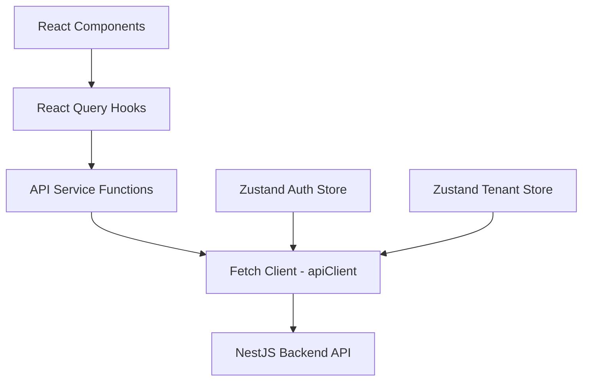

# Pandalang Frontend — API Client Layer

## 1. Overview

The API client layer provides type-safe communication with the Pandalang NestJS backend. It consists of three layers:



1. **Fetch Client** (`lib/api/client.ts`) — Low-level fetch wrapper with interceptors
2. **API Service Functions** (`lib/api/services/*.ts`) — Typed functions per API endpoint
3. **React Query Hooks** (`features/*/hooks/*.ts`) — Caching, mutations, optimistic updates

## 2. API Response Types

All backend responses follow a consistent envelope. Define matching TypeScript types:

```typescript
// types/api.ts

/** Standard success response */
export interface ApiResponse<T> {
  success: true
  data: T
  meta: {
    timestamp: string
    requestId: string
  }
}

/** Paginated success response */
export interface PaginatedResponse<T> {
  success: true
  data: T[]
  meta: {
    page: number
    limit: number
    total: number
    totalPages: number
    timestamp: string
    requestId: string
  }
}

/** Error response */
export interface ApiErrorResponse {
  success: false
  error: {
    code: string
    message: string
    details?: Array<{
      field: string
      message: string
    }>
  }
  meta: {
    timestamp: string
    requestId: string
  }
}

/** Pagination query params */
export interface PaginationParams {
  page?: number
  limit?: number
  sortBy?: string
  sortOrder?: 'asc' | 'desc'
}
```

## 3. Domain Types

Types derived from the API swagger schemas. Each maps to a backend DTO:

```typescript
// types/auth.ts
export interface AuthUser {
  id: string
  email: string
  firstName: string
  lastName: string
  tenantId: string
  roles: string[]
  isActive: boolean
}

export interface AuthResponse {
  accessToken: string
  refreshToken: string
  user: AuthUser
}

export interface TokensResponse {
  accessToken: string
  refreshToken: string
}

export interface LoginRequest {
  email: string
  password: string
  tenantSlug: string
}

export interface RegisterRequest {
  email: string
  password: string
  firstName: string
  lastName: string
  tenantSlug: string
}

// types/tenant.ts
export type TenantStatus = 'ACTIVE' | 'SUSPENDED' | 'TRIAL'

export interface Tenant {
  id: string
  name: string
  slug: string
  domain: string | null
  settings: Record<string, unknown>
  status: TenantStatus
  createdAt: string
  updatedAt: string
}

// types/user.ts
export interface Role {
  id: string
  name: string
}

export interface User {
  id: string
  tenantId: string
  email: string
  firstName: string
  lastName: string
  avatar: string | null
  isActive: boolean
  lastLoginAt: string | null
  createdAt: string
  updatedAt: string
  roles: Role[]
}

// types/course.ts
export type CourseLevel = 'BEGINNER' | 'INTERMEDIATE' | 'ADVANCED'
export type CourseStatus = 'DRAFT' | 'PUBLISHED' | 'ARCHIVED'
export type ContentType = 'TEXT' | 'VIDEO' | 'AUDIO' | 'DOCUMENT'

export interface Course {
  id: string
  tenantId: string
  instructorId: string
  title: string
  slug: string
  description: string | null
  thumbnail: string | null
  level: CourseLevel
  status: CourseStatus
  sortOrder: number
  metadata: Record<string, unknown>
  publishedAt: string | null
  createdAt: string
  updatedAt: string
  sectionsCount?: number
  lessonsCount?: number
}

export interface Section {
  id: string
  courseId: string
  title: string
  description: string | null
  sortOrder: number
  createdAt: string
  updatedAt: string
  lessonsCount?: number
}

export interface Lesson {
  id: string
  sectionId: string
  title: string
  content: string | null
  contentType: ContentType
  mediaUrl: string | null
  durationMinutes: number | null
  sortOrder: number
  createdAt: string
  updatedAt: string
}

// types/enrollment.ts
export type EnrollmentStatus = 'ACTIVE' | 'COMPLETED' | 'DROPPED'

export interface Enrollment {
  id: string
  userId: string
  courseId: string
  tenantId: string
  status: EnrollmentStatus
  progressPercent: number
  enrolledAt: string
  completedAt: string | null
  course?: EnrollmentCourse
  user?: EnrollmentUser
}

export interface EnrollmentCourse {
  id: string
  title: string
  slug: string
  thumbnail: string | null
  level: string
}

export interface EnrollmentUser {
  id: string
  email: string
  firstName: string
  lastName: string
}

// types/quiz.ts
export type QuestionType = 'MULTIPLE_CHOICE' | 'TRUE_FALSE' | 'FILL_IN_BLANK'

export interface Quiz {
  id: string
  sectionId: string
  title: string
  description: string | null
  passingScore: number
  timeLimitMinutes: number | null
  sortOrder: number
  createdAt: string
  updatedAt: string
  questions?: QuizQuestion[]
  questionsCount?: number
}

export interface QuizQuestion {
  id: string
  quizId: string
  question: string
  questionType: QuestionType
  points: number
  sortOrder: number
  answers?: QuizAnswer[]
}

export interface QuizAnswer {
  id: string
  answer: string
  sortOrder: number
  // isCorrect is NOT exposed to students by the API
}

export interface QuizAttempt {
  id: string
  userId: string
  quizId: string
  enrollmentId: string
  score: number
  maxScore: number
  passed: boolean
  answers: unknown
  startedAt: string
  completedAt: string | null
}
```

## 4. Fetch Client

A custom fetch wrapper that handles auth headers, tenant context, token refresh, and error normalization:

```typescript
// lib/api/client.ts — Conceptual design

class ApiClient {
  private baseUrl: string
  private getAccessToken: () => string | null
  private getTenantId: () => string | null
  private onTokenRefresh: () => Promise<string | null>
  private onAuthError: () => void

  constructor(config: ApiClientConfig) { ... }

  async request<T>(endpoint: string, options?: RequestOptions): Promise<T> {
    const url = `${this.baseUrl}${endpoint}`

    const headers: HeadersInit = {
      'Content-Type': 'application/json',
      ...options?.headers,
    }

    // Inject auth token
    const token = this.getAccessToken()
    if (token) {
      headers['Authorization'] = `Bearer ${token}`
    }

    // Inject tenant ID
    const tenantId = this.getTenantId()
    if (tenantId) {
      headers['x-tenant-id'] = tenantId
    }

    const response = await fetch(url, {
      method: options?.method ?? 'GET',
      headers,
      body: options?.body ? JSON.stringify(options.body) : undefined,
    })

    // Handle 401 — attempt token refresh
    if (response.status === 401 && token) {
      const newToken = await this.onTokenRefresh()
      if (newToken) {
        // Retry original request with new token
        headers['Authorization'] = `Bearer ${newToken}`
        const retryResponse = await fetch(url, { ...options, headers })
        return this.handleResponse<T>(retryResponse)
      }
      this.onAuthError()
      throw new ApiError('Session expired', 401)
    }

    return this.handleResponse<T>(response)
  }

  private async handleResponse<T>(response: Response): Promise<T> {
    const data = await response.json()

    if (!response.ok) {
      throw new ApiError(
        data.error?.message ?? 'Request failed',
        response.status,
        data.error?.code,
        data.error?.details,
      )
    }

    // Unwrap the envelope — return data directly
    return data.data as T
  }

  // Convenience methods
  get<T>(endpoint: string, params?: Record<string, string>) { ... }
  post<T>(endpoint: string, body?: unknown) { ... }
  patch<T>(endpoint: string, body?: unknown) { ... }
  delete<T>(endpoint: string) { ... }
}

// Custom error class
export class ApiError extends Error {
  constructor(
    message: string,
    public status: number,
    public code?: string,
    public details?: Array<{ field: string; message: string }>,
  ) {
    super(message)
  }
}
```

### Client Initialization

```typescript
// lib/api/client.ts

import { useAuthStore } from '@/stores/auth.store'
import { useTenantStore } from '@/stores/tenant.store'

export const apiClient = new ApiClient({
  baseUrl: process.env.NEXT_PUBLIC_API_URL ?? 'http://localhost:3000',
  getAccessToken: () => useAuthStore.getState().accessToken,
  getTenantId: () => useTenantStore.getState().tenantId,
  onTokenRefresh: async () => {
    // Call refresh endpoint
    const refreshToken = useAuthStore.getState().refreshToken
    if (!refreshToken) return null

    const response = await fetch('/api/auth/refresh', {
      method: 'POST',
      headers: { 'Content-Type': 'application/json' },
      body: JSON.stringify({ refreshToken }),
    })

    if (!response.ok) return null

    const data = await response.json()
    useAuthStore.getState().setTokens(data.accessToken, data.refreshToken)
    return data.accessToken
  },
  onAuthError: () => {
    useAuthStore.getState().logout()
    window.location.href = '/login'
  },
})
```

## 5. API Endpoint Constants

```typescript
// lib/api/endpoints.ts

const API_V1 = '/api/v1'

export const ENDPOINTS = {
  auth: {
    register: `${API_V1}/auth/register`,
    login: `${API_V1}/auth/login`,
    refresh: `${API_V1}/auth/refresh`,
    logout: `${API_V1}/auth/logout`,
    me: `${API_V1}/auth/me`,
  },
  tenants: {
    list: `${API_V1}/tenants`,
    create: `${API_V1}/tenants`,
    detail: (id: string) => `${API_V1}/tenants/${id}`,
    update: (id: string) => `${API_V1}/tenants/${id}`,
    updateStatus: (id: string) => `${API_V1}/tenants/${id}/status`,
  },
  users: {
    list: `${API_V1}/users`,
    create: `${API_V1}/users`,
    detail: (id: string) => `${API_V1}/users/${id}`,
    update: (id: string) => `${API_V1}/users/${id}`,
    deactivate: (id: string) => `${API_V1}/users/${id}`,
    assignRole: (id: string) => `${API_V1}/users/${id}/roles`,
    removeRole: (id: string, roleId: string) => `${API_V1}/users/${id}/roles/${roleId}`,
  },
  courses: {
    list: `${API_V1}/courses`,
    create: `${API_V1}/courses`,
    detail: (id: string) => `${API_V1}/courses/${id}`,
    update: (id: string) => `${API_V1}/courses/${id}`,
    delete: (id: string) => `${API_V1}/courses/${id}`,
    publish: (id: string) => `${API_V1}/courses/${id}/publish`,
    archive: (id: string) => `${API_V1}/courses/${id}/archive`,
    enrollments: (id: string) => `${API_V1}/courses/${id}/enrollments`,
  },
  sections: {
    list: (courseId: string) => `${API_V1}/courses/${courseId}/sections`,
    create: (courseId: string) => `${API_V1}/courses/${courseId}/sections`,
    update: (courseId: string, id: string) => `${API_V1}/courses/${courseId}/sections/${id}`,
    delete: (courseId: string, id: string) => `${API_V1}/courses/${courseId}/sections/${id}`,
  },
  lessons: {
    list: (courseId: string, sectionId: string) =>
      `${API_V1}/courses/${courseId}/sections/${sectionId}/lessons`,
    create: (courseId: string, sectionId: string) =>
      `${API_V1}/courses/${courseId}/sections/${sectionId}/lessons`,
    detail: (courseId: string, sectionId: string, id: string) =>
      `${API_V1}/courses/${courseId}/sections/${sectionId}/lessons/${id}`,
    update: (courseId: string, sectionId: string, id: string) =>
      `${API_V1}/courses/${courseId}/sections/${sectionId}/lessons/${id}`,
    delete: (courseId: string, sectionId: string, id: string) =>
      `${API_V1}/courses/${courseId}/sections/${sectionId}/lessons/${id}`,
  },
  quizzes: {
    create: (courseId: string, sectionId: string) =>
      `${API_V1}/courses/${courseId}/sections/${sectionId}/quizzes`,
    detail: (id: string) => `${API_V1}/quizzes/${id}`,
    update: (id: string) => `${API_V1}/quizzes/${id}`,
    delete: (id: string) => `${API_V1}/quizzes/${id}`,
    addQuestion: (id: string) => `${API_V1}/quizzes/${id}/questions`,
    updateQuestion: (id: string, qId: string) => `${API_V1}/quizzes/${id}/questions/${qId}`,
    deleteQuestion: (id: string, qId: string) => `${API_V1}/quizzes/${id}/questions/${qId}`,
    submitAttempt: (id: string) => `${API_V1}/quizzes/${id}/attempts`,
    listAttempts: (id: string) => `${API_V1}/quizzes/${id}/attempts`,
  },
  enrollments: {
    create: `${API_V1}/enrollments`,
    me: `${API_V1}/enrollments/me`,
    detail: (id: string) => `${API_V1}/enrollments/${id}`,
    updateProgress: (id: string) => `${API_V1}/enrollments/${id}/progress`,
  },
  health: {
    liveness: `${API_V1}/health`,
    readiness: `${API_V1}/health/ready`,
  },
} as const
```

## 6. API Service Functions

Thin typed wrappers around the fetch client:

```typescript
// lib/api/services/auth.service.ts

import { apiClient } from '../client'
import { ENDPOINTS } from '../endpoints'
import type { AuthResponse, LoginRequest, RegisterRequest, TokensResponse, AuthUser } from '@/types'

export const authService = {
  login: (data: LoginRequest) =>
    apiClient.post<AuthResponse>(ENDPOINTS.auth.login, data),

  register: (data: RegisterRequest) =>
    apiClient.post<AuthResponse>(ENDPOINTS.auth.register, data),

  refresh: (refreshToken: string) =>
    apiClient.post<TokensResponse>(ENDPOINTS.auth.refresh, { refreshToken }),

  logout: () =>
    apiClient.post<void>(ENDPOINTS.auth.logout),

  getMe: () =>
    apiClient.get<AuthUser>(ENDPOINTS.auth.me),
}
```

```typescript
// lib/api/services/courses.service.ts

import { apiClient } from '../client'
import { ENDPOINTS } from '../endpoints'
import type { Course, Section, Lesson, PaginationParams } from '@/types'

export const coursesService = {
  list: (params?: PaginationParams & { search?: string; status?: string; level?: string }) =>
    apiClient.get<Course[]>(ENDPOINTS.courses.list, params as Record<string, string>),

  getById: (id: string) =>
    apiClient.get<Course>(ENDPOINTS.courses.detail(id)),

  create: (data: { title: string; description?: string; level?: string }) =>
    apiClient.post<Course>(ENDPOINTS.courses.create, data),

  update: (id: string, data: Partial<Course>) =>
    apiClient.patch<Course>(ENDPOINTS.courses.update(id), data),

  delete: (id: string) =>
    apiClient.delete<void>(ENDPOINTS.courses.delete(id)),

  publish: (id: string) =>
    apiClient.patch<Course>(ENDPOINTS.courses.publish(id)),

  archive: (id: string) =>
    apiClient.patch<Course>(ENDPOINTS.courses.archive(id)),
}
```

## 7. React Query Hooks

Each feature module exposes React Query hooks:

```typescript
// features/courses/hooks/use-courses.ts

import { useQuery } from '@tanstack/react-query'
import { coursesService } from '@/lib/api/services/courses.service'
import type { PaginationParams } from '@/types'

export const courseKeys = {
  all: ['courses'] as const,
  lists: () => [...courseKeys.all, 'list'] as const,
  list: (params: Record<string, unknown>) => [...courseKeys.lists(), params] as const,
  details: () => [...courseKeys.all, 'detail'] as const,
  detail: (id: string) => [...courseKeys.details(), id] as const,
}

export function useCourses(params?: PaginationParams & { search?: string; status?: string }) {
  return useQuery({
    queryKey: courseKeys.list(params ?? {}),
    queryFn: () => coursesService.list(params),
  })
}
```

```typescript
// features/courses/hooks/use-course.ts

import { useQuery } from '@tanstack/react-query'
import { coursesService } from '@/lib/api/services/courses.service'
import { courseKeys } from './use-courses'

export function useCourse(courseId: string) {
  return useQuery({
    queryKey: courseKeys.detail(courseId),
    queryFn: () => coursesService.getById(courseId),
    enabled: !!courseId,
  })
}
```

```typescript
// features/courses/hooks/use-create-course.ts

import { useMutation, useQueryClient } from '@tanstack/react-query'
import { coursesService } from '@/lib/api/services/courses.service'
import { courseKeys } from './use-courses'

export function useCreateCourse() {
  const queryClient = useQueryClient()

  return useMutation({
    mutationFn: coursesService.create,
    onSuccess: () => {
      queryClient.invalidateQueries({ queryKey: courseKeys.lists() })
    },
  })
}
```

### Query Key Factory Pattern

Every feature uses a consistent query key factory for cache management:

```typescript
export const {feature}Keys = {
  all:     ['{feature}'] as const,
  lists:   () => [...{feature}Keys.all, 'list'] as const,
  list:    (params) => [...{feature}Keys.lists(), params] as const,
  details: () => [...{feature}Keys.all, 'detail'] as const,
  detail:  (id) => [...{feature}Keys.details(), id] as const,
}
```

This enables granular cache invalidation:
- `queryClient.invalidateQueries({ queryKey: courseKeys.all })` — invalidate everything
- `queryClient.invalidateQueries({ queryKey: courseKeys.lists() })` — invalidate all lists
- `queryClient.invalidateQueries({ queryKey: courseKeys.detail(id) })` — invalidate one course

## 8. Error Handling Strategy

```typescript
// In React Query global config
const queryClient = new QueryClient({
  defaultOptions: {
    queries: {
      retry: (failureCount, error) => {
        // Don't retry on 4xx errors
        if (error instanceof ApiError && error.status < 500) return false
        return failureCount < 3
      },
      staleTime: 5 * 60 * 1000, // 5 minutes
    },
    mutations: {
      onError: (error) => {
        // Show toast for mutation errors
        if (error instanceof ApiError) {
          toast.error(error.message)
        }
      },
    },
  },
})
```
