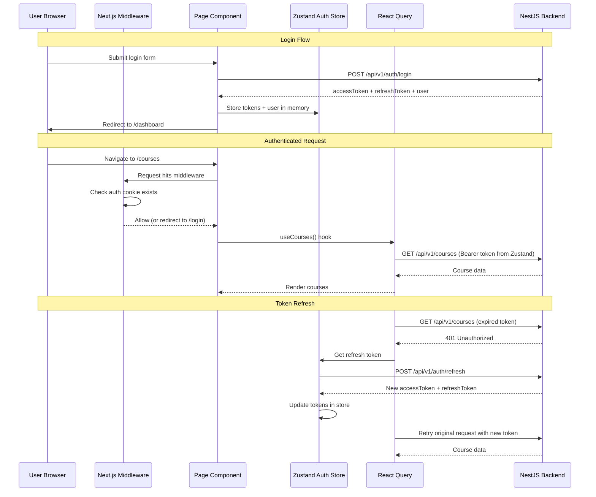
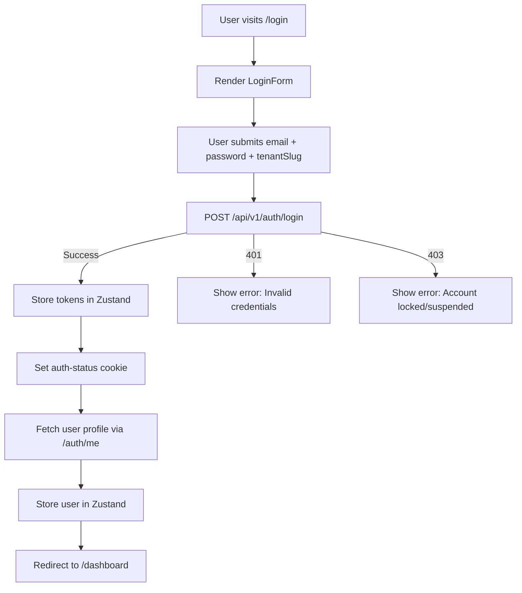
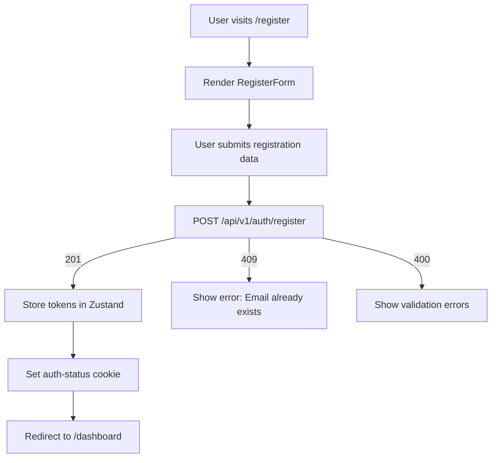
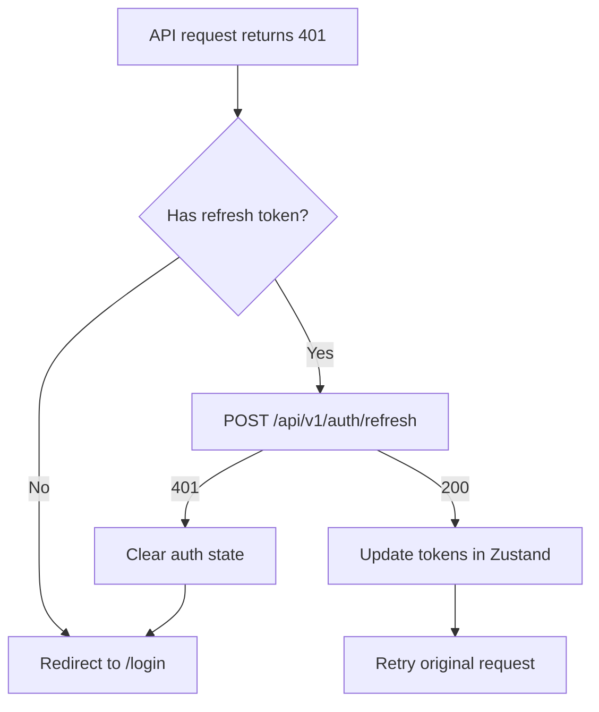
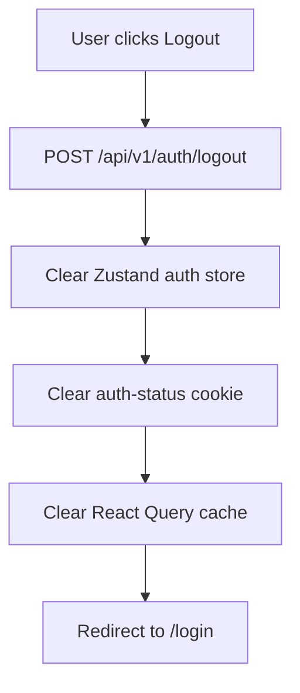
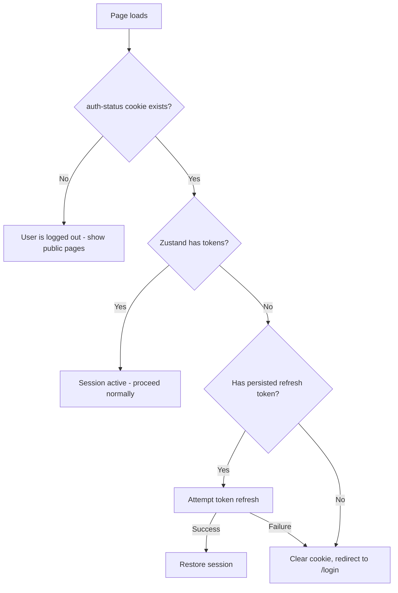

# Pandalang Frontend — Authentication & Routing

## 1. Auth Architecture Overview



## 2. Token Storage Strategy

### Approach: In-Memory Tokens + Lightweight Auth Cookie

| Token | Storage | Purpose |
|-------|---------|---------|
| **Access Token** | Zustand store (memory only) | Sent as Bearer token on API requests |
| **Refresh Token** | Zustand store (memory only) | Used to obtain new access token |
| **Auth Flag Cookie** | httpOnly cookie via Next.js API route | Tells middleware "user is logged in" for SSR route protection |

### Why not localStorage?

- **XSS vulnerability**: localStorage is accessible to any JavaScript on the page
- **Memory-only** tokens are cleared on tab close (more secure)
- **Refresh token** handles session restoration on page reload

### Why the auth flag cookie?

Next.js middleware runs on the Edge and cannot access Zustand stores. A lightweight cookie (not the actual JWT) tells middleware whether to allow or redirect:

```typescript
// On login success:
document.cookie = 'auth-status=authenticated; path=/; max-age=604800; SameSite=Lax'

// On logout:
document.cookie = 'auth-status=; path=/; max-age=0'
```

The actual JWT is never stored in cookies — only a flag indicating "this user has an active session."

## 3. Auth Flow Details

### 3.1 Login Flow



### 3.2 Registration Flow



### 3.3 Token Refresh Flow



### 3.4 Logout Flow



### 3.5 Session Restoration (Page Reload)

When the user refreshes the page, in-memory tokens are lost. The app needs to restore the session:



**Implementation**: Use Zustand's `persist` middleware to store the refresh token in `sessionStorage` (cleared on browser close). On app initialization, if a refresh token exists, silently refresh to get a new access token.

## 4. Next.js Middleware

The middleware runs on every request and handles:
1. **Auth protection**: Redirect unauthenticated users away from protected routes
2. **Auth redirect**: Redirect authenticated users away from login/register
3. **Role-based access**: Redirect users without proper roles

```typescript
// middleware.ts — Conceptual design

import { NextResponse } from 'next/server'
import type { NextRequest } from 'next/server'

// Routes that don't require authentication
const PUBLIC_ROUTES = ['/login', '/register']

// Routes that require specific roles
const ROLE_ROUTES: Record<string, string[]> = {
  '/tenants': ['SUPER_ADMIN'],
  '/users': ['SUPER_ADMIN', 'TENANT_ADMIN'],
}

export function middleware(request: NextRequest) {
  const { pathname } = request.nextUrl
  const authStatus = request.cookies.get('auth-status')?.value
  const isAuthenticated = authStatus === 'authenticated'

  // Allow public routes
  if (PUBLIC_ROUTES.some(route => pathname.startsWith(route))) {
    // Redirect authenticated users away from login/register
    if (isAuthenticated) {
      return NextResponse.redirect(new URL('/dashboard', request.url))
    }
    return NextResponse.next()
  }

  // Protect dashboard routes
  if (!isAuthenticated) {
    const loginUrl = new URL('/login', request.url)
    loginUrl.searchParams.set('callbackUrl', pathname)
    return NextResponse.redirect(loginUrl)
  }

  return NextResponse.next()
}

export const config = {
  matcher: [
    // Match all routes except static files and API routes
    '/((?!api|_next/static|_next/image|favicon.ico|.*\\..*$).*)',
  ],
}
```

### Role-Based Access Control (Client-Side)

Since middleware cannot decode JWTs (no access to the secret), role-based access is enforced client-side using a `RoleGate` component:

```typescript
// components/shared/role-gate.tsx

'use client'

import { useAuthStore } from '@/stores/auth.store'
import { redirect } from 'next/navigation'

interface RoleGateProps {
  allowedRoles: string[]
  children: React.ReactNode
  fallback?: React.ReactNode
}

export function RoleGate({ allowedRoles, children, fallback }: RoleGateProps) {
  const user = useAuthStore(state => state.user)

  if (!user) return null

  const hasRole = user.roles.some(role => allowedRoles.includes(role))

  if (!hasRole) {
    if (fallback) return fallback
    redirect('/dashboard')
  }

  return children
}
```

## 5. Route Structure

### Public Routes (no auth required)

| Route | Page | Description |
|-------|------|-------------|
| `/login` | Login page | Email + password + tenant slug |
| `/register` | Register page | Student self-registration |

### Protected Routes (auth required)

| Route | Page | Roles | Description |
|-------|------|-------|-------------|
| `/dashboard` | Dashboard | All | Role-aware home page |
| `/courses` | Course list | All | Catalog (student) / Management (instructor/admin) |
| `/courses/new` | Create course | Instructor, Admin | Course creation form |
| `/courses/[courseId]` | Course detail | All | Course overview with sections |
| `/courses/[courseId]/edit` | Course editor | Instructor (own), Admin | Course builder with sections/lessons/quizzes |
| `/courses/[courseId]/sections/[sectionId]/lessons/[lessonId]` | Lesson viewer | Enrolled Student, Instructor, Admin | Lesson content viewer |
| `/courses/[courseId]/quizzes/[quizId]` | Quiz taker | Enrolled Student | Quiz taking interface |
| `/courses/[courseId]/enrollments` | Course enrollments | Instructor (own), Admin | Student list with progress |
| `/enrollments` | My enrollments | Student | Enrolled courses with progress |
| `/users` | User list | Admin | Tenant user management |
| `/users/new` | Create user | Admin | User creation form |
| `/users/[userId]` | User detail | Admin, Self | User profile |
| `/tenants` | Tenant list | Super Admin | Platform tenant management |
| `/tenants/new` | Create tenant | Super Admin | Tenant creation form |
| `/tenants/[tenantId]` | Tenant detail | Super Admin | Tenant settings |
| `/settings` | Settings | All | User profile settings |

## 6. Tenant Resolution

The frontend needs to know which tenant the user belongs to. This is resolved in order:

1. **From URL subdomain** (future): `beijing-academy.pandalang.com`
2. **From login response**: `user.tenantId` stored in Zustand
3. **From environment variable**: `NEXT_PUBLIC_DEFAULT_TENANT_SLUG` for development

The tenant ID is sent as `x-tenant-id` header on every API request via the fetch client interceptor.

### Tenant Slug for Login/Register

The login and register forms require a `tenantSlug`. For MVP:
- Use a text input field for tenant slug
- Pre-fill from `NEXT_PUBLIC_DEFAULT_TENANT_SLUG` in development
- Future: Extract from subdomain automatically

## 7. Auth Store Integration

```typescript
// stores/auth.store.ts — Conceptual design

interface AuthState {
  accessToken: string | null
  refreshToken: string | null
  user: AuthUser | null
  isAuthenticated: boolean
  isLoading: boolean

  // Actions
  setTokens: (accessToken: string, refreshToken: string) => void
  setUser: (user: AuthUser) => void
  login: (response: AuthResponse) => void
  logout: () => void
  initialize: () => Promise<void>
}
```

See [06-state-management.md](./06-state-management.md) for full store implementation.
