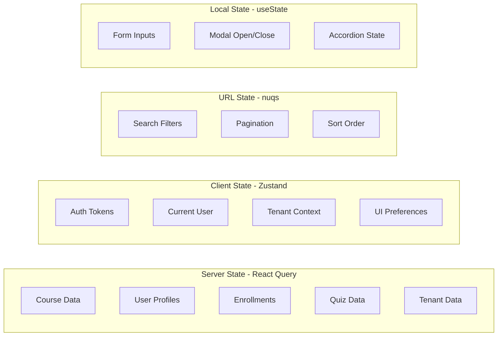
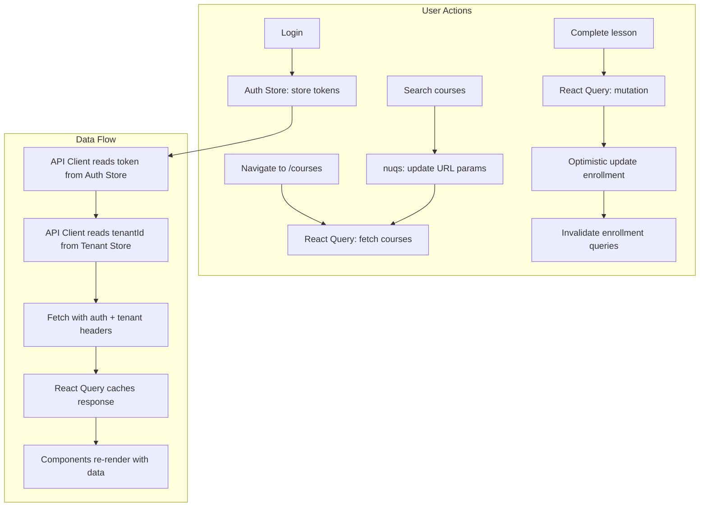

# Pandalang Frontend — State Management

## 1. State Categories



| Category | Tool | Examples |
|----------|------|---------|
| **Server State** | React Query | API data: courses, users, enrollments, quizzes |
| **Client State** | Zustand | Auth tokens, user session, tenant context, UI prefs |
| **URL State** | nuqs | Search query, pagination page, filters, sort order |
| **Local State** | React useState | Form values, modal visibility, component-level toggles |

## 2. Zustand Stores

### 2.1 Auth Store

Manages authentication tokens and current user session.

```typescript
// stores/auth.store.ts

import { create } from 'zustand'
import { persist, createJSONStorage } from 'zustand/middleware'
import type { AuthUser, AuthResponse } from '@/types'

interface AuthState {
  // State
  accessToken: string | null
  refreshToken: string | null
  user: AuthUser | null
  isInitialized: boolean

  // Computed
  isAuthenticated: boolean

  // Actions
  login: (response: AuthResponse) => void
  setTokens: (accessToken: string, refreshToken: string) => void
  setUser: (user: AuthUser) => void
  logout: () => void
  setInitialized: (value: boolean) => void
}

export const useAuthStore = create<AuthState>()(
  persist(
    (set, get) => ({
      // Initial state
      accessToken: null,
      refreshToken: null,
      user: null,
      isInitialized: false,

      // Computed
      get isAuthenticated() {
        return !!get().accessToken && !!get().user
      },

      // Actions
      login: (response) => {
        set({
          accessToken: response.accessToken,
          refreshToken: response.refreshToken,
          user: response.user,
        })
        // Set auth cookie for middleware
        document.cookie = 'auth-status=authenticated; path=/; max-age=604800; SameSite=Lax'
      },

      setTokens: (accessToken, refreshToken) => {
        set({ accessToken, refreshToken })
      },

      setUser: (user) => {
        set({ user })
      },

      logout: () => {
        set({
          accessToken: null,
          refreshToken: null,
          user: null,
        })
        // Clear auth cookie
        document.cookie = 'auth-status=; path=/; max-age=0'
      },

      setInitialized: (value) => {
        set({ isInitialized: value })
      },
    }),
    {
      name: 'pandalang-auth',
      storage: createJSONStorage(() => sessionStorage),
      // Only persist refresh token — access token stays in memory
      partialize: (state) => ({
        refreshToken: state.refreshToken,
        user: state.user,
      }),
    },
  ),
)
```

### 2.2 Tenant Store

Manages the current tenant context for multi-tenancy.

```typescript
// stores/tenant.store.ts

import { create } from 'zustand'
import { persist, createJSONStorage } from 'zustand/middleware'

interface TenantState {
  // State
  tenantId: string | null
  tenantSlug: string | null
  tenantName: string | null

  // Actions
  setTenant: (id: string, slug: string, name: string) => void
  clearTenant: () => void
}

export const useTenantStore = create<TenantState>()(
  persist(
    (set) => ({
      tenantId: null,
      tenantSlug: null,
      tenantName: null,

      setTenant: (id, slug, name) => {
        set({ tenantId: id, tenantSlug: slug, tenantName: name })
      },

      clearTenant: () => {
        set({ tenantId: null, tenantSlug: null, tenantName: null })
      },
    }),
    {
      name: 'pandalang-tenant',
      storage: createJSONStorage(() => sessionStorage),
    },
  ),
)
```

### 2.3 UI Store

Manages UI preferences and transient UI state.

```typescript
// stores/ui.store.ts

import { create } from 'zustand'
import { persist, createJSONStorage } from 'zustand/middleware'

interface UIState {
  // State
  sidebarOpen: boolean
  sidebarCollapsed: boolean

  // Actions
  toggleSidebar: () => void
  setSidebarOpen: (open: boolean) => void
  toggleSidebarCollapsed: () => void
}

export const useUIStore = create<UIState>()(
  persist(
    (set) => ({
      sidebarOpen: true,
      sidebarCollapsed: false,

      toggleSidebar: () => set((state) => ({ sidebarOpen: !state.sidebarOpen })),
      setSidebarOpen: (open) => set({ sidebarOpen: open }),
      toggleSidebarCollapsed: () =>
        set((state) => ({ sidebarCollapsed: !state.sidebarCollapsed })),
    }),
    {
      name: 'pandalang-ui',
      storage: createJSONStorage(() => localStorage),
    },
  ),
)
```

## 3. React Query Configuration

### 3.1 Query Client Setup

```typescript
// components/providers/query-provider.tsx

'use client'

import { QueryClient, QueryClientProvider } from '@tanstack/react-query'
import { ReactQueryDevtools } from '@tanstack/react-query-devtools'
import { useState } from 'react'
import { ApiError } from '@/lib/api/client'

function makeQueryClient() {
  return new QueryClient({
    defaultOptions: {
      queries: {
        // Data is fresh for 5 minutes
        staleTime: 5 * 60 * 1000,
        // Cache is kept for 10 minutes after last subscriber unmounts
        gcTime: 10 * 60 * 1000,
        // Don't retry on client errors (4xx)
        retry: (failureCount, error) => {
          if (error instanceof ApiError && error.status < 500) return false
          return failureCount < 3
        },
        // Refetch on window focus (user returns to tab)
        refetchOnWindowFocus: true,
        // Don't refetch on reconnect by default
        refetchOnReconnect: 'always',
      },
      mutations: {
        // Global mutation error handler
        onError: (error) => {
          if (error instanceof ApiError) {
            // Toast is handled per-mutation, but this is a fallback
            console.error('Mutation error:', error.message)
          }
        },
      },
    },
  })
}

export function QueryProvider({ children }: { children: React.ReactNode }) {
  const [queryClient] = useState(() => makeQueryClient())

  return (
    <QueryClientProvider client={queryClient}>
      {children}
      <ReactQueryDevtools initialIsOpen={false} />
    </QueryClientProvider>
  )
}
```

### 3.2 Cache Strategy by Feature

| Feature | staleTime | gcTime | Refetch Strategy |
|---------|-----------|--------|-----------------|
| **Auth (me)** | 10 min | 30 min | On window focus |
| **Courses (list)** | 5 min | 10 min | On window focus, on mutation |
| **Course (detail)** | 5 min | 10 min | On mutation |
| **Sections/Lessons** | 2 min | 5 min | On mutation |
| **Enrollments (my)** | 2 min | 5 min | On progress update |
| **Quiz** | 1 min | 5 min | Before attempt |
| **Users (list)** | 5 min | 10 min | On mutation |
| **Tenants (list)** | 10 min | 30 min | On mutation |

### 3.3 Optimistic Updates

For instant UI feedback on mutations:

```typescript
// Example: Mark lesson as complete (optimistic update)

export function useUpdateProgress() {
  const queryClient = useQueryClient()

  return useMutation({
    mutationFn: ({ enrollmentId, data }: { enrollmentId: string; data: UpdateProgressDto }) =>
      enrollmentsService.updateProgress(enrollmentId, data),

    // Optimistic update
    onMutate: async ({ enrollmentId, data }) => {
      // Cancel outgoing refetches
      await queryClient.cancelQueries({ queryKey: enrollmentKeys.detail(enrollmentId) })

      // Snapshot previous value
      const previous = queryClient.getQueryData(enrollmentKeys.detail(enrollmentId))

      // Optimistically update
      queryClient.setQueryData(enrollmentKeys.detail(enrollmentId), (old: Enrollment) => ({
        ...old,
        progressPercent: old.progressPercent + 10, // Approximate
      }))

      return { previous }
    },

    // Rollback on error
    onError: (_err, _vars, context) => {
      if (context?.previous) {
        queryClient.setQueryData(enrollmentKeys.detail(_vars.enrollmentId), context.previous)
      }
    },

    // Refetch after success or error
    onSettled: (_data, _err, { enrollmentId }) => {
      queryClient.invalidateQueries({ queryKey: enrollmentKeys.detail(enrollmentId) })
      queryClient.invalidateQueries({ queryKey: enrollmentKeys.lists() })
    },
  })
}
```

### 3.4 Prefetching

Prefetch data before the user navigates:

```typescript
// Prefetch course detail on hover
function CourseCard({ course }: { course: Course }) {
  const queryClient = useQueryClient()

  const handleMouseEnter = () => {
    queryClient.prefetchQuery({
      queryKey: courseKeys.detail(course.id),
      queryFn: () => coursesService.getById(course.id),
      staleTime: 5 * 60 * 1000,
    })
  }

  return (
    <Link href={`/courses/${course.id}`} onMouseEnter={handleMouseEnter}>
      ...
    </Link>
  )
}
```

## 4. URL State with nuqs

For search, filter, and pagination state that should be shareable via URL:

```typescript
// features/courses/hooks/use-course-filters.ts

import { useQueryStates, parseAsString, parseAsInteger } from 'nuqs'

export function useCourseFilters() {
  return useQueryStates({
    search: parseAsString.withDefault(''),
    status: parseAsString.withDefault(''),
    level: parseAsString.withDefault(''),
    page: parseAsInteger.withDefault(1),
    limit: parseAsInteger.withDefault(20),
    sortBy: parseAsString.withDefault('createdAt'),
    sortOrder: parseAsString.withDefault('desc'),
  })
}

// Usage in component:
// const [filters, setFilters] = useCourseFilters()
// URL: /courses?search=mandarin&status=PUBLISHED&page=1
```

## 5. State Flow Diagram



## 6. Session Initialization

On app load, restore session from persisted state:

```typescript
// components/providers/auth-initializer.tsx

'use client'

import { useEffect } from 'react'
import { useAuthStore } from '@/stores/auth.store'
import { authService } from '@/lib/api/services/auth.service'

export function AuthInitializer({ children }: { children: React.ReactNode }) {
  const { refreshToken, setTokens, setUser, logout, setInitialized, isInitialized } =
    useAuthStore()

  useEffect(() => {
    async function initialize() {
      if (!refreshToken) {
        setInitialized(true)
        return
      }

      try {
        // Attempt to refresh tokens
        const tokens = await authService.refresh(refreshToken)
        setTokens(tokens.accessToken, tokens.refreshToken)

        // Fetch current user
        const user = await authService.getMe()
        setUser(user)
      } catch {
        // Refresh failed — session expired
        logout()
      } finally {
        setInitialized(true)
      }
    }

    initialize()
  }, []) // eslint-disable-line react-hooks/exhaustive-deps

  if (!isInitialized) {
    return <FullPageSpinner /> // or null
  }

  return children
}
```
