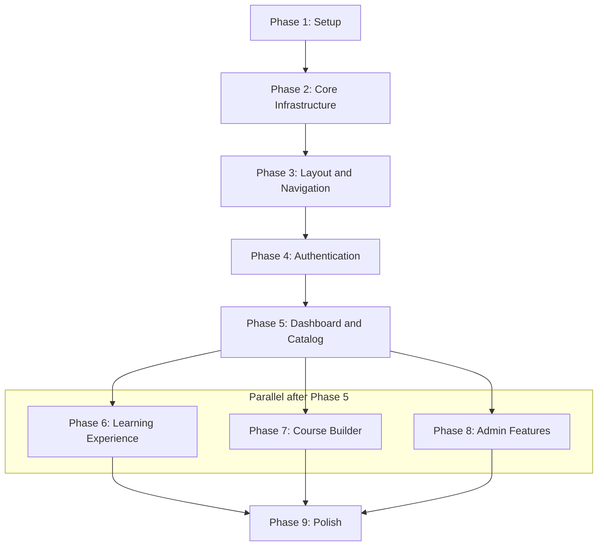

# Pandalang Frontend — Implementation Tasks

## Overview

This document breaks down the entire frontend MVP into **phases** and **tasks**. Each task is designed to be executed as a focused unit of work.

### How to Use This Document

1. Work through phases sequentially (Phase 1 → Phase 2 → ...)
2. Within each phase, tasks are ordered by dependency
3. Each task includes what to build, which files to create, and what to reference
4. After each task, verify the output before proceeding
5. Reference the corresponding plan document for detailed specifications

### Conventions
- 📋 = Reference document
- 🔗 = Depends on previous task
- ✅ = Verification step

---

## Phase 1: Project Setup & Configuration

### Task 1.1: Install Dependencies

> Install all required npm packages for the project.

**Production dependencies:**
```
pnpm add @tanstack/react-query @tanstack/react-query-devtools zustand react-hook-form zod @hookform/resolvers date-fns nuqs sonner next-themes @dnd-kit/core @dnd-kit/sortable @dnd-kit/utilities
```

**Dev dependencies:**
```
pnpm add -D prettier prettier-plugin-tailwindcss
```

📋 Reference: [02-technology-stack.md](./02-technology-stack.md)

✅ **Verify**: `pnpm install` succeeds, no peer dependency conflicts

---

### Task 1.2: Initialize shadcn/ui

> Set up shadcn/ui with the project's design system configuration.

1. Run `pnpm dlx shadcn@latest init`
   - Style: Default
   - Base color: Slate (or Neutral)
   - CSS variables: Yes
   - Tailwind CSS config: Use CSS variables
   - Components directory: `components/ui`
   - Utils location: `lib/utils.ts`

2. Install core shadcn components:
```
pnpm dlx shadcn@latest add button card input label dialog dropdown-menu tabs table badge avatar skeleton progress select textarea checkbox switch separator sheet scroll-area alert-dialog command popover radio-group toast
```

3. Update `app/globals.css` with the project's color palette and CSS variables.

📋 Reference: [07-ui-architecture.md](./07-ui-architecture.md) Section 4.1

✅ **Verify**: Import a `Button` component and render it — styles apply correctly

---

### Task 1.3: Environment Configuration

> Create environment files and Next.js configuration.

1. Create `.env.local` with:
   ```
   NEXT_PUBLIC_API_URL=http://localhost:3000
   NEXT_PUBLIC_APP_URL=http://localhost:3001
   NEXT_PUBLIC_DEFAULT_TENANT_SLUG=demo
   ```

2. Create `.env.example` as a template (same keys, placeholder values).

3. Update `next.config.ts`:
   - Add `images.remotePatterns` for CDN domains
   - Add API rewrites if needed for CORS during development

4. Add `.env.local` to `.gitignore` (should already be there).

📋 Reference: [02-technology-stack.md](./02-technology-stack.md) Section 9

✅ **Verify**: `process.env.NEXT_PUBLIC_API_URL` is accessible in a component

---

### Task 1.4: Create Directory Structure

> Scaffold the project directory structure with placeholder files.

Create the following directories and barrel `index.ts` files:
- `lib/api/` — `client.ts`, `endpoints.ts`, `types.ts`
- `lib/api/services/` — placeholder
- `types/` — `api.ts`, `auth.ts`, `course.ts`, `enrollment.ts`, `quiz.ts`, `user.ts`, `tenant.ts`, `index.ts`
- `stores/` — `auth.store.ts`, `tenant.store.ts`, `ui.store.ts`
- `hooks/` — placeholder
- `features/auth/`, `features/courses/`, `features/enrollments/`, `features/quizzes/`, `features/users/`, `features/tenants/` — each with `components/`, `hooks/`, `schemas/` subdirectories
- `components/layout/` — placeholder
- `components/shared/` — placeholder
- `components/providers/` — placeholder

📋 Reference: [03-project-structure.md](./03-project-structure.md) Section 2

✅ **Verify**: All directories exist, TypeScript compiles

---

### Task 1.5: Set Up Providers

> Create the provider wrapper components that wrap the entire app.

1. Create `components/providers/query-provider.tsx` — React Query provider with default options (staleTime, retry logic, gcTime).
2. Create `components/providers/theme-provider.tsx` — next-themes provider with system default.
3. Create `components/providers/providers.tsx` — Composed provider that wraps QueryProvider + ThemeProvider.
4. Update `app/layout.tsx`:
   - Import and wrap children with `<Providers>`
   - Update metadata (title: "Pandalang", description)
   - Keep Geist fonts

📋 Reference: [06-state-management.md](./06-state-management.md) Section 3.1, [07-ui-architecture.md](./07-ui-architecture.md) Section 1.1

✅ **Verify**: App renders with React Query devtools visible in development

---

## Phase 2: Core Infrastructure

### Task 2.1: TypeScript Types

> Define all TypeScript types matching the backend API schemas.

Create types in `types/`:
- `api.ts` — `ApiResponse<T>`, `PaginatedResponse<T>`, `ApiErrorResponse`, `PaginationParams`
- `auth.ts` — `AuthUser`, `AuthResponse`, `TokensResponse`, `LoginRequest`, `RegisterRequest`
- `tenant.ts` — `Tenant`, `TenantStatus`, `CreateTenantRequest`, `UpdateTenantRequest`
- `user.ts` — `User`, `Role`, `CreateUserRequest`, `UpdateUserRequest`
- `course.ts` — `Course`, `Section`, `Lesson`, `CourseLevel`, `CourseStatus`, `ContentType`, create/update request types
- `enrollment.ts` — `Enrollment`, `EnrollmentStatus`, `EnrollmentCourse`, `EnrollmentUser`, `UpdateProgressRequest`
- `quiz.ts` — `Quiz`, `QuizQuestion`, `QuizAnswer`, `QuizAttempt`, `QuestionType`, `SubmitQuizRequest`
- `index.ts` — Barrel export all types

📋 Reference: [04-api-client-layer.md](./04-api-client-layer.md) Sections 2-3

✅ **Verify**: TypeScript compiles, types are importable via `@/types`

---

### Task 2.2: API Client

> Build the fetch wrapper with auth interceptors, tenant header injection, and token refresh.

1. Create `lib/api/client.ts`:
   - `ApiClient` class with `get`, `post`, `patch`, `delete` methods
   - Auto-inject `Authorization: Bearer <token>` from auth store
   - Auto-inject `x-tenant-id` header from tenant store
   - Handle 401 responses with automatic token refresh
   - `ApiError` custom error class with status, code, details
   - Unwrap API response envelope (return `data` directly)

2. Create `lib/api/endpoints.ts`:
   - All API endpoint constants organized by feature
   - Dynamic endpoints as functions (e.g., `detail: (id) => ...`)

3. Export singleton `apiClient` instance

📋 Reference: [04-api-client-layer.md](./04-api-client-layer.md) Sections 4-5

✅ **Verify**: Can make a test request to `/api/v1/health` and get a response

---

### Task 2.3: API Service Functions

> Create typed service functions for each API endpoint group.

Create in `lib/api/services/`:
- `auth.service.ts` — login, register, refresh, logout, getMe
- `tenants.service.ts` — list, getById, create, update, updateStatus
- `users.service.ts` — list, getById, create, update, deactivate, assignRole, removeRole
- `courses.service.ts` — list, getById, create, update, delete, publish, archive
- `sections.service.ts` — list, create, update, delete
- `lessons.service.ts` — list, getById, create, update, delete
- `quizzes.service.ts` — create, getById, update, delete, addQuestion, updateQuestion, deleteQuestion, submitAttempt, listAttempts
- `enrollments.service.ts` — create, getMyEnrollments, getById, updateProgress, getCourseEnrollments

📋 Reference: [04-api-client-layer.md](./04-api-client-layer.md) Section 6

✅ **Verify**: Service functions are typed and importable

---

### Task 2.4: Zustand Stores

> Create the three Zustand stores for client state.

1. Create `stores/auth.store.ts`:
   - State: `accessToken`, `refreshToken`, `user`, `isInitialized`
   - Actions: `login`, `setTokens`, `setUser`, `logout`, `setInitialized`
   - Persist: `refreshToken` and `user` to sessionStorage
   - Cookie management for auth-status flag

2. Create `stores/tenant.store.ts`:
   - State: `tenantId`, `tenantSlug`, `tenantName`
   - Actions: `setTenant`, `clearTenant`
   - Persist to sessionStorage

3. Create `stores/ui.store.ts`:
   - State: `sidebarOpen`, `sidebarCollapsed`
   - Actions: `toggleSidebar`, `setSidebarOpen`, `toggleSidebarCollapsed`
   - Persist to localStorage

📋 Reference: [06-state-management.md](./06-state-management.md) Section 2

✅ **Verify**: Stores are functional, persist middleware works

---

### Task 2.5: Auth Initializer

> Create the session restoration component that runs on app load.

1. Create `components/providers/auth-initializer.tsx`:
   - On mount, check if refresh token exists in persisted store
   - If yes, attempt silent token refresh
   - If refresh succeeds, fetch user profile via `/auth/me`
   - If refresh fails, clear auth state and cookie
   - Set `isInitialized = true` when done
   - Show loading spinner until initialized

2. Add `AuthInitializer` to the provider tree in `providers.tsx`

📋 Reference: [06-state-management.md](./06-state-management.md) Section 6

✅ **Verify**: On page reload, session is restored if refresh token is valid

---

### Task 2.6: Next.js Middleware

> Create the auth middleware for route protection.

1. Create `middleware.ts` at project root:
   - Define public routes: `/login`, `/register`
   - Check `auth-status` cookie
   - Redirect unauthenticated users to `/login` with `callbackUrl`
   - Redirect authenticated users away from `/login`, `/register` to `/dashboard`
   - Configure matcher to exclude static files, API routes, images

📋 Reference: [05-auth-and-routing.md](./05-auth-and-routing.md) Section 4

✅ **Verify**: Unauthenticated access to `/dashboard` redirects to `/login`

---

## Phase 3: Layout & Navigation

### Task 3.1: Auth Layout

> Create the centered card layout for login/register pages.

1. Create `app/(auth)/layout.tsx`:
   - Centered layout with max-width card
   - Pandalang logo/branding at top
   - Clean, minimal design
   - No sidebar, no header

📋 Reference: [07-ui-architecture.md](./07-ui-architecture.md) Section 1.2

✅ **Verify**: `/login` renders in centered card layout

---

### Task 3.2: Dashboard Layout

> Create the full dashboard layout with sidebar, header, and main content area.

1. Create `components/layout/sidebar.tsx`:
   - Collapsible sidebar with role-based navigation items
   - Active route highlighting
   - Collapse/expand toggle
   - Pandalang logo at top
   - User role determines visible nav items

2. Create `components/layout/header.tsx`:
   - Top bar with:
     - Mobile menu toggle (hamburger)
     - Breadcrumbs or page title
     - Theme toggle (light/dark/system)
     - User avatar dropdown (profile, settings, logout)

3. Create `components/layout/mobile-nav.tsx`:
   - Sheet-based slide-out navigation for mobile
   - Same nav items as sidebar

4. Create `components/layout/breadcrumbs.tsx`:
   - Auto-generate breadcrumbs from current route path

5. Create `app/(dashboard)/layout.tsx`:
   - Compose sidebar + header + main content area
   - Responsive: sidebar hidden on mobile, sheet on toggle

📋 Reference: [07-ui-architecture.md](./07-ui-architecture.md) Sections 1.3, 2

✅ **Verify**: Dashboard layout renders with sidebar, header, and content area. Sidebar collapses on mobile.

---

### Task 3.3: Shared Components

> Build reusable components used across multiple pages.

1. Create `components/shared/page-header.tsx` — Page title + description + action buttons
2. Create `components/shared/empty-state.tsx` — Icon + message + CTA for empty lists
3. Create `components/shared/loading-skeleton.tsx` — Skeleton patterns (card grid, table rows)
4. Create `components/shared/confirm-dialog.tsx` — "Are you sure?" confirmation dialog
5. Create `components/shared/role-gate.tsx` — Conditional render based on user roles
6. Create `components/shared/data-table.tsx` — Generic sortable/filterable data table
7. Create `components/shared/pagination.tsx` — Page navigation controls

📋 Reference: [07-ui-architecture.md](./07-ui-architecture.md) Section 3.1

✅ **Verify**: Components render correctly in isolation

---

## Phase 4: Authentication Feature

### Task 4.1: Auth Schemas

> Create Zod validation schemas for auth forms.

1. Create `features/auth/schemas/login.schema.ts`:
   - `loginSchema`: email (valid email), password (min 1 char), tenantSlug (min 1 char)

2. Create `features/auth/schemas/register.schema.ts`:
   - `registerSchema`: email, password (min 8, uppercase, lowercase, digit), firstName, lastName, tenantSlug

📋 Reference: [04-api-client-layer.md](./04-api-client-layer.md) — RegisterDto, LoginDto

✅ **Verify**: Schemas validate correct and incorrect inputs

---

### Task 4.2: Auth Hooks

> Create React Query hooks for auth operations.

1. Create `features/auth/hooks/use-login.ts` — `useMutation` wrapping `authService.login`
2. Create `features/auth/hooks/use-register.ts` — `useMutation` wrapping `authService.register`
3. Create `features/auth/hooks/use-logout.ts` — `useMutation` wrapping `authService.logout` + clear stores + clear cache
4. Create `features/auth/hooks/use-current-user.ts` — `useQuery` wrapping `authService.getMe` (enabled when authenticated)

📋 Reference: [04-api-client-layer.md](./04-api-client-layer.md) Section 7

---

### Task 4.3: Auth Components & Pages

> Build login and register forms and pages.

1. Create `features/auth/components/login-form.tsx`:
   - React Hook Form + Zod resolver
   - Email, password, tenant slug fields
   - Submit calls `useLogin` mutation
   - On success: store tokens, set cookie, redirect
   - Error display for invalid credentials

2. Create `features/auth/components/register-form.tsx`:
   - React Hook Form + Zod resolver
   - firstName, lastName, email, password, tenantSlug fields
   - Password strength indicator
   - Submit calls `useRegister` mutation
   - On success: store tokens, redirect

3. Create `features/auth/components/user-menu.tsx`:
   - Avatar dropdown in header
   - Shows user name and role
   - Links to settings, logout action

4. Create `app/(auth)/login/page.tsx` — Renders LoginForm
5. Create `app/(auth)/register/page.tsx` — Renders RegisterForm

📋 Reference: [08-page-inventory.md](./08-page-inventory.md) Sections 2.1, 2.2

✅ **Verify**: Full login → dashboard → logout flow works end-to-end

---

## Phase 5: Dashboard & Course Catalog

### Task 5.1: Dashboard Page

> Build the role-aware dashboard home page.

1. Create `app/(dashboard)/dashboard/page.tsx`:
   - Read user roles from auth store
   - Render different dashboard content per role:
     - **Student**: Stat cards (enrolled, in progress, completed) + continue learning list
     - **Instructor**: Stat cards (courses, students, published) + my courses grid
     - **Tenant Admin**: Stat cards (users, courses, enrollments) + recent activity
     - **Super Admin**: Stat cards (tenants, total users) + quick actions

2. Create supporting components:
   - `features/courses/components/course-card.tsx` — Reusable course preview card
   - Stat card component (number + label + icon)

📋 Reference: [08-page-inventory.md](./08-page-inventory.md) Section 2.3

✅ **Verify**: Dashboard shows role-appropriate content for each user type

---

### Task 5.2: Course List Page

> Build the course catalog/management page with filters.

1. Create `features/courses/hooks/use-courses.ts` — Query key factory + `useCourses` hook with pagination/filter params
2. Create `features/courses/components/course-list.tsx` — Grid of course cards with loading skeletons
3. Create `app/(dashboard)/courses/page.tsx`:
   - Page header with "New Course" button (role-gated)
   - Search input, level filter, status filter (using nuqs for URL state)
   - Course grid with pagination
   - Role-based filtering (students see PUBLISHED only)

📋 Reference: [08-page-inventory.md](./08-page-inventory.md) Section 2.4

✅ **Verify**: Course list loads, filters work, pagination works

---

### Task 5.3: Course Detail Page

> Build the course detail view with section accordion.

1. Create `features/courses/hooks/use-course.ts` — Single course query
2. Create `features/courses/hooks/use-sections.ts` — Sections list query
3. Create `features/enrollments/hooks/use-enroll.ts` — Enroll mutation
4. Create `features/enrollments/components/enroll-button.tsx` — Enroll button with loading state
5. Create `features/courses/components/course-detail.tsx`:
   - Course header (title, level, status, description)
   - Enroll button or progress bar (based on enrollment status)
   - Sections accordion with lesson list
   - Lessons link to lesson viewer
   - Quizzes link to quiz taker

6. Create `app/(dashboard)/courses/[courseId]/page.tsx` — Renders CourseDetail

📋 Reference: [08-page-inventory.md](./08-page-inventory.md) Section 2.5

✅ **Verify**: Course detail shows sections, enrollment works

---

## Phase 6: Learning Experience

### Task 6.1: Lesson Viewer

> Build the lesson content viewer with progress tracking.

1. Create `features/courses/hooks/use-lessons.ts` — Lessons list + single lesson queries
2. Create `features/enrollments/hooks/use-update-progress.ts` — Progress update mutation with optimistic update
3. Create `features/courses/components/lesson-viewer.tsx`:
   - Lesson title and section context
   - Content renderer based on contentType (TEXT, VIDEO, AUDIO, DOCUMENT)
   - "Mark Complete" button
   - Previous/Next lesson navigation
   - Time tracking (optional)

4. Create `app/(dashboard)/courses/[courseId]/sections/[sectionId]/lessons/[lessonId]/page.tsx`

📋 Reference: [08-page-inventory.md](./08-page-inventory.md) Section 2.7

✅ **Verify**: Lesson content displays, marking complete updates progress

---

### Task 6.2: Quiz Taker

> Build the quiz-taking interface with grading.

1. Create `features/quizzes/hooks/use-quiz.ts` — Single quiz query
2. Create `features/quizzes/hooks/use-submit-quiz.ts` — Submit attempt mutation
3. Create `features/quizzes/hooks/use-quiz-attempts.ts` — List attempts query
4. Create `features/quizzes/schemas/quiz.schema.ts` — Zod schema for quiz submission
5. Create `features/quizzes/components/quiz-question.tsx`:
   - Renders question based on type (MULTIPLE_CHOICE, TRUE_FALSE, FILL_IN_BLANK)
   - Radio buttons for MC/TF, text input for fill-in-blank

6. Create `features/quizzes/components/quiz-taker.tsx`:
   - Question navigation (previous/next)
   - Progress indicator
   - Timer (if timeLimitMinutes set)
   - Submit button
   - Confirmation dialog before submit

7. Create `features/quizzes/components/quiz-results.tsx`:
   - Score display (score/maxScore, percentage)
   - Pass/fail status
   - Back to course link

8. Create `app/(dashboard)/courses/[courseId]/quizzes/[quizId]/page.tsx`

📋 Reference: [08-page-inventory.md](./08-page-inventory.md) Section 2.8

✅ **Verify**: Quiz loads, answers can be selected, submission returns graded result

---

### Task 6.3: My Enrollments Page

> Build the student's enrollment list with progress.

1. Create `features/enrollments/hooks/use-enrollments.ts` — My enrollments query
2. Create `features/enrollments/components/enrollment-card.tsx` — Card with course info + progress bar
3. Create `features/enrollments/components/enrollment-list.tsx` — Grid grouped by status (in progress, completed)
4. Create `app/(dashboard)/enrollments/page.tsx`

📋 Reference: [08-page-inventory.md](./08-page-inventory.md) Section 2.9

✅ **Verify**: Enrolled courses show with progress, "Continue" links work

---

## Phase 7: Course Builder (Instructor)

### Task 7.1: Create Course Page

> Build the course creation form.

1. Create `features/courses/schemas/course.schema.ts` — Zod schema for course creation
2. Create `features/courses/hooks/use-create-course.ts` — Create course mutation
3. Create `features/courses/components/course-form.tsx` — Form with title, description, level
4. Create `app/(dashboard)/courses/new/page.tsx` — Role-gated (Instructor/Admin)

📋 Reference: [08-page-inventory.md](./08-page-inventory.md) — Course creation

✅ **Verify**: Course creation works, redirects to edit page

---

### Task 7.2: Course Editor Page

> Build the full course builder with section/lesson/quiz management.

1. Create `features/courses/hooks/use-update-course.ts` — Update course mutation
2. Create `features/courses/schemas/section.schema.ts` — Section validation
3. Create `features/courses/schemas/lesson.schema.ts` — Lesson validation
4. Create `features/quizzes/schemas/question.schema.ts` — Question + answers validation

5. Create course builder components:
   - `features/courses/components/course-builder/section-list.tsx` — Sortable section list with @dnd-kit
   - `features/courses/components/course-builder/section-form.tsx` — Add/edit section dialog
   - `features/courses/components/course-builder/lesson-list.tsx` — Lessons within a section
   - `features/courses/components/course-builder/lesson-form.tsx` — Add/edit lesson dialog
   - `features/courses/components/course-builder/sortable-item.tsx` — DnD wrapper

6. Create quiz management in course builder:
   - `features/quizzes/components/quiz-form.tsx` — Create/edit quiz dialog
   - `features/quizzes/components/question-form.tsx` — Add/edit question with answers

7. Create `app/(dashboard)/courses/[courseId]/edit/page.tsx`:
   - Course details form (title, description, level)
   - Section list with add/edit/delete/reorder
   - Lesson list per section with add/edit/delete
   - Quiz management per section
   - Publish/Archive/Delete actions

📋 Reference: [08-page-inventory.md](./08-page-inventory.md) Section 2.6

✅ **Verify**: Full CRUD for sections, lessons, quizzes. Drag-and-drop reordering works. Publish validates content.

---

### Task 7.3: Course Enrollments View (Instructor)

> Build the instructor's view of enrolled students.

1. Create `features/enrollments/hooks/use-course-enrollments.ts` — Course enrollments query
2. Create `app/(dashboard)/courses/[courseId]/enrollments/page.tsx`:
   - Student table with name, email, progress, status
   - Search filter
   - Pagination

📋 Reference: [08-page-inventory.md](./08-page-inventory.md) Section 2.10

✅ **Verify**: Instructor sees enrolled students with progress data

---

## Phase 8: Admin Features

### Task 8.1: User Management

> Build the tenant admin's user management pages.

1. Create `features/users/hooks/use-users.ts` — Users list query with filters
2. Create `features/users/hooks/use-user.ts` — Single user query
3. Create `features/users/hooks/use-create-user.ts` — Create user mutation
4. Create `features/users/hooks/use-assign-role.ts` — Assign/remove role mutations
5. Create `features/users/schemas/user.schema.ts` — User creation/update validation
6. Create `features/users/components/user-table.tsx` — Paginated table with search, role filter
7. Create `features/users/components/user-form.tsx` — Create user form with role selection
8. Create `features/users/components/user-detail.tsx` — User profile with role management
9. Create `features/users/components/role-badge.tsx` — Colored role badge

10. Create pages:
    - `app/(dashboard)/users/page.tsx` — User list (role-gated: Admin)
    - `app/(dashboard)/users/new/page.tsx` — Create user
    - `app/(dashboard)/users/[userId]/page.tsx` — User detail

📋 Reference: [08-page-inventory.md](./08-page-inventory.md) Sections 2.11, 2.12

✅ **Verify**: Admin can list, create, view users. Role assignment works.

---

### Task 8.2: Tenant Management

> Build the super admin's tenant management pages.

1. Create `features/tenants/hooks/use-tenants.ts` — Tenants list query
2. Create `features/tenants/hooks/use-tenant.ts` — Single tenant query
3. Create `features/tenants/hooks/use-create-tenant.ts` — Create tenant mutation
4. Create `features/tenants/schemas/tenant.schema.ts` — Tenant validation
5. Create `features/tenants/components/tenant-table.tsx` — Tenant list table with status badges
6. Create `features/tenants/components/tenant-form.tsx` — Create/edit tenant form
7. Create `features/tenants/components/tenant-detail.tsx` — Tenant settings with status controls

8. Create pages:
    - `app/(dashboard)/tenants/page.tsx` — Tenant list (role-gated: Super Admin)
    - `app/(dashboard)/tenants/new/page.tsx` — Create tenant
    - `app/(dashboard)/tenants/[tenantId]/page.tsx` — Tenant detail/settings

📋 Reference: [08-page-inventory.md](./08-page-inventory.md) Sections 2.13, 2.14

✅ **Verify**: Super Admin can list, create, view, suspend/activate tenants

---

### Task 8.3: Settings Page

> Build the user settings/profile page.

1. Create `app/(dashboard)/settings/page.tsx`:
   - Profile section: edit firstName, lastName, avatar
   - Appearance section: theme toggle (light/dark/system)
   - Account info section: role, tenant, member since (read-only)

📋 Reference: [08-page-inventory.md](./08-page-inventory.md) Section 2.15

✅ **Verify**: Profile updates save, theme toggle works

---

## Phase 9: Polish & Error Handling

### Task 9.1: Error Pages

> Create global error handling pages.

1. Create `app/not-found.tsx` — Custom 404 page with "Go Home" link
2. Create `app/error.tsx` — Global error boundary with retry button
3. Create `app/(dashboard)/loading.tsx` — Dashboard-wide loading skeleton

---

### Task 9.2: Toast Notifications

> Add toast notifications for all mutations.

1. Add `<Toaster />` from sonner to root layout
2. Add success/error toasts to all mutation hooks:
   - Login success/failure
   - Course created/updated/published/deleted
   - Enrollment created
   - Lesson completed
   - Quiz submitted
   - User created/updated/deactivated
   - Tenant created/updated/suspended

---

### Task 9.3: Responsive Polish

> Ensure all pages work well on mobile.

1. Test and fix sidebar behavior on mobile (Sheet drawer)
2. Test course grid responsiveness (1 col mobile, 2 tablet, 3 desktop)
3. Test data tables on mobile (horizontal scroll or card view)
4. Test forms on mobile (full-width inputs)
5. Test quiz taker on mobile

---

### Task 9.4: Loading States

> Add proper loading skeletons to all pages.

1. Add `loading.tsx` files for key route segments
2. Add skeleton components for:
   - Course card grid
   - Data table rows
   - Course detail page
   - Lesson viewer
   - Dashboard stat cards

---

## Summary: Task Count by Phase

| Phase | Tasks | Description |
|-------|-------|-------------|
| Phase 1 | 5 | Project setup: deps, shadcn, env, structure, providers |
| Phase 2 | 6 | Core infra: types, API client, services, stores, auth init, middleware |
| Phase 3 | 3 | Layout: auth layout, dashboard layout, shared components |
| Phase 4 | 3 | Auth: schemas, hooks, login/register pages |
| Phase 5 | 3 | Dashboard + course catalog: dashboard, course list, course detail |
| Phase 6 | 3 | Learning: lesson viewer, quiz taker, enrollments |
| Phase 7 | 3 | Course builder: create, edit, instructor enrollments view |
| Phase 8 | 3 | Admin: user management, tenant management, settings |
| Phase 9 | 4 | Polish: errors, toasts, responsive, loading states |
| **Total** | **33** | |

## Execution Order Dependency Graph

