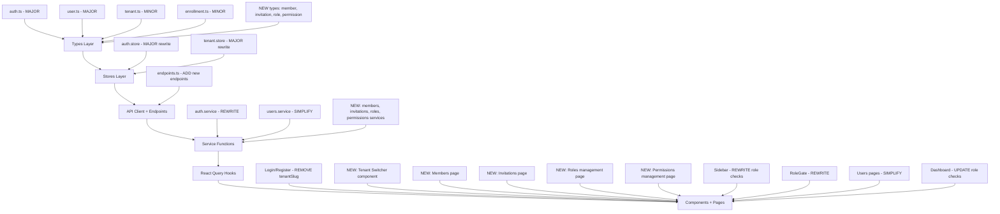
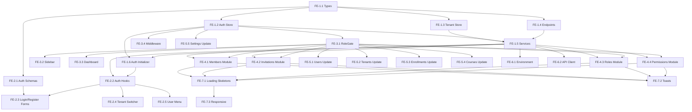

# Pandalang Frontend — Multi-Tenancy V2 Migration Tasks

## Overview

This document contains the frontend implementation tasks for migrating from the single-tenant-per-user architecture to the multi-tenant-per-user architecture described in [multi-tenancy-v2/12-multi-tenancy-v2-changes.md](../multi-tenancy-v2/12-multi-tenancy-v2-changes.md).

### What Changed in the Backend

The backend has migrated to a multi-tenant-per-user model where:

1. **Login no longer requires `tenantSlug`** — users log in with email + password only
2. **Login returns a tenants list** — each with `tenantId`, `tenantName`, `tenantSlug`, `roleName`, `roleId`, `status`
3. **New `POST /auth/switch-tenant` endpoint** — issues a new JWT scoped to the selected tenant
4. **`AuthUser` no longer has `tenantId` or `roles[]`** — replaced by `isSuperAdmin` boolean + tenants array
5. **`User` no longer has `tenantId` or `roles[]`** — replaced by `isSuperAdmin` + `tenants[]` array with per-tenant role info
6. **`Tenant` now has `ownerId`** — and a new `transfer-ownership` endpoint
7. **New API modules**: Members, Invitations, Roles, Permissions, Role-Permissions
8. **Registration no longer requires `tenantSlug`** — creates a global account
9. **Enrollment now supports `grantedBy`** — dual enrollment model (self-enroll + admin-granted)
10. **Auth uses httpOnly cookies** — no more `accessToken`/`refreshToken` in response body; `CookieAuthResponseDto` returns only `user` + `tenants`
11. **Users endpoint removed**: `POST /users` (create), `POST /users/:id/roles`, `DELETE /users/:id/roles/:roleId` — replaced by Members + Invitations modules

### Impact Summary



---

## Phase FE-1: Types and Core Infrastructure

### Task FE-1.1: Update TypeScript Types for V2 API

> Rewrite type definitions to match the new backend API schemas from `api-docs.json`.

**Files to modify:**

1. **`types/auth.ts`** — Major rewrite:
   - Remove `tenantId` and `roles: string[]` from `AuthUser`
   - Add `isSuperAdmin: boolean` to `AuthUser`
   - Add `UserTenant` interface: `{ tenantId, tenantName, tenantSlug, roleName, roleId, status }`
   - Change `AuthResponse` to `CookieAuthResponseDto` shape: `{ user: AuthUser, tenants?: UserTenant[] }` (no tokens — cookies are httpOnly)
   - Add `SwitchTenantResponse`: `{ tenantId, tenantSlug, roleName, roleId }`
   - Remove `tenantSlug` from `LoginRequest` — keep only `email`, `password`
   - Remove `tenantSlug` from `RegisterRequest` — keep only `email`, `password`, `firstName`, `lastName`
   - Remove `TokensResponse` — refresh is cookie-based now, returns `{ success: boolean }`
   - Add `SwitchTenantRequest`: `{ tenantId: string }`

2. **`types/user.ts`** — Major rewrite:
   - Remove `tenantId` from `User`
   - Remove `roles: Role[]` from `User`
   - Add `isSuperAdmin: boolean` to `User`
   - Add `tenants: UserTenantSummary[]` to `User` where `UserTenantSummary` = `{ tenantId, tenantName, tenantSlug, roleName, roleId, status }`
   - Remove `CreateUserRequest` — user creation is now via registration + invitation
   - Remove `AssignRoleRequest` — replaced by Members module `ChangeRoleDto`
   - Keep `UpdateUserRequest` (firstName, lastName, avatar)

3. **`types/tenant.ts`** — Minor update:
   - Add `ownerId: string` to `Tenant`

4. **`types/enrollment.ts`** — Minor update:
   - Add `grantedBy: string | null` to `Enrollment`
   - Add `GrantEnrollmentRequest`: `{ courseId: string, userId: string }` for admin/instructor granting access
   - Update `UpdateProgressRequest`: change `completed` to `isCompleted`, add optional `timeSpentSeconds`

5. **NEW `types/member.ts`**:
   - `MemberUser`: `{ id, email, firstName, lastName }`
   - `Member`: `{ id, userId, tenantId, roleId, roleName, status: MemberStatus, joinedAt, user?: MemberUser }`
   - `MemberStatus`: `'ACTIVE' | 'SUSPENDED'`
   - `ChangeRoleRequest`: `{ roleId: string }`
   - `ListMembersParams`: extends `PaginationParams` with `roleId?`, `status?`, `search?`

6. **NEW `types/invitation.ts`**:
   - `InvitationStatus`: `'PENDING' | 'ACCEPTED' | 'EXPIRED' | 'CANCELLED'`
   - `InvitationTenant`: `{ name, slug }`
   - `Invitation`: `{ id, tenantId, email, roleId, roleName, status, invitedBy, expiresAt, createdAt, tenant?: InvitationTenant }`
   - `CreateInvitationRequest`: `{ email, roleId }`
   - `AcceptInvitationRequest`: `{ token: string }`

7. **NEW `types/role.ts`**:
   - `PlatformRole`: `{ id, name, description?: string | null, isSystem, createdAt }`
   - `CreateRoleRequest`: `{ name, description? }`
   - `UpdateRoleRequest`: `{ name?, description? }`

8. **NEW `types/permission.ts`**:
   - `Permission`: `{ id, action, subject, conditions?: object | null, inverted, reason?: string | null }`
   - `CreatePermissionRequest`: `{ action, subject, conditions?, inverted?, reason? }`
   - `RolePermission`: `{ id, roleId, roleName, permissionId, action, subject, tenantId }`
   - `AssignPermissionRequest`: `{ roleId, permissionId }`

9. **`types/index.ts`** — Add barrel exports for new type files

✅ **Verify**: TypeScript compiles with no errors

---

### Task FE-1.2: Update Auth Store for V2

> Rewrite the auth store to handle the new multi-tenant auth model where tokens are in httpOnly cookies and the user has multiple tenant memberships.

**File to modify: `stores/auth.store.ts`**

Current state: Store holds `user: AuthUser | null` with `tenantId` and `roles[]` on the user object.

New state:
- `user: AuthUser | null` — now has `isSuperAdmin` instead of `tenantId`/`roles`
- `tenants: UserTenant[]` — list of tenant memberships from login response
- `currentTenantId: string | null` — the currently active tenant (set after switch-tenant)
- `currentRole: string | null` — role name in the current tenant (e.g. `'INSTRUCTOR'`)
- `currentRoleId: string | null` — role ID in the current tenant
- `isInitialized: boolean`

Actions:
- `login(response: AuthResponse)` — stores user + tenants list, no tokens (cookies handle that)
- `setUser(user: AuthUser)` — update user profile
- `setTenants(tenants: UserTenant[])` — update tenants list (e.g. after accepting invitation)
- `switchTenant(response: SwitchTenantResponse)` — sets `currentTenantId`, `currentRole`, `currentRoleId`
- `logout()` — clears all state
- `setInitialized(value: boolean)`

Computed:
- `isAuthenticated` — `!!user`
- `isSuperAdmin` — `user?.isSuperAdmin ?? false`
- `hasMultipleTenants` — `tenants.length > 1`
- `currentTenant` — derived from `tenants.find(t => t.tenantId === currentTenantId)`

Persist: `user`, `tenants`, `currentTenantId`, `currentRole`, `currentRoleId` to sessionStorage

✅ **Verify**: Store compiles, actions work correctly

---

### Task FE-1.3: Update Tenant Store for V2

> Simplify the tenant store — most tenant context now lives in the auth store. The tenant store becomes a thin wrapper for the resolved tenant from subdomain or auth context.

**File to modify: `stores/tenant.store.ts`**

The tenant store should now derive its state from the auth store's `currentTenantId`. It may still be useful for:
- Caching the resolved tenant slug/name for the current session
- Providing a simple `tenantId` getter for the API client

Update:
- `tenantId` — synced from auth store's `currentTenantId`
- `tenantSlug` — from the current tenant in auth store's tenants list
- `tenantName` — from the current tenant in auth store's tenants list
- `setFromAuthStore()` — reads current tenant from auth store and sets local state
- `clearTenant()` — clears state

✅ **Verify**: Tenant store syncs correctly with auth store

---

### Task FE-1.4: Update API Endpoints for V2

> Add new endpoint constants for Members, Invitations, Roles, Permissions, Role-Permissions, and update existing endpoints.

**File to modify: `lib/api/endpoints.ts`**

Add:
```
auth.switchTenant: /api/v1/auth/switch-tenant

tenants.transferOwnership: (id) => /api/v1/tenants/${id}/transfer-ownership

members.list: /api/v1/members
members.detail: (id) => /api/v1/members/${id}
members.changeRole: (id) => /api/v1/members/${id}/role
members.suspend: (id) => /api/v1/members/${id}/suspend
members.activate: (id) => /api/v1/members/${id}/activate
members.remove: (id) => /api/v1/members/${id}

invitations.list: /api/v1/invitations
invitations.create: /api/v1/invitations
invitations.cancel: (id) => /api/v1/invitations/${id}
invitations.accept: /api/v1/invitations/accept

roles.list: /api/v1/roles
roles.create: /api/v1/roles
roles.detail: (id) => /api/v1/roles/${id}
roles.update: (id) => /api/v1/roles/${id}
roles.delete: (id) => /api/v1/roles/${id}

permissions.list: /api/v1/permissions
permissions.create: /api/v1/permissions
permissions.detail: (id) => /api/v1/permissions/${id}
permissions.delete: (id) => /api/v1/permissions/${id}

rolePermissions.list: /api/v1/role-permissions
rolePermissions.assign: /api/v1/role-permissions
rolePermissions.remove: (id) => /api/v1/role-permissions/${id}
```

Remove from `users`:
- `users.create` — no longer exists
- `users.assignRole` — replaced by members module
- `users.removeRole` — replaced by members module

✅ **Verify**: All endpoints match `api-docs.json` paths

---

### Task FE-1.5: Update API Service Functions for V2

> Update existing services and create new service files for the new API modules.

**Files to modify:**

1. **`lib/api/services/auth.service.ts`** — Major rewrite:
   - `login(data: LoginRequest)` — no `tenantSlug`, returns `AuthResponse` (user + tenants)
   - `register(data: RegisterRequest)` — no `tenantSlug`, returns `AuthResponse` (user only, no tenants)
   - `switchTenant(data: SwitchTenantRequest)` — NEW: `POST /auth/switch-tenant`, returns `SwitchTenantResponse`
   - `refresh()` — no body needed (cookie-based), returns `{ success: boolean }`
   - `logout()` — same
   - `getMe()` — returns `AuthUser` (with tenants list from the `/auth/me` endpoint)

2. **`lib/api/services/users.service.ts`** — Simplify:
   - Remove `create()` — no longer exists
   - Remove `assignRole()` — replaced by members module
   - Remove `removeRole()` — replaced by members module
   - Keep `list()`, `getById()`, `update()`, `deactivate()`

3. **`lib/api/services/tenants.service.ts`** — Minor update:
   - Add `transferOwnership(id: string, body: { newOwnerId: string })`

4. **`lib/api/services/enrollments.service.ts`** — Minor update:
   - Update `create()` to accept either `CreateEnrollmentRequest` (self-enroll) or `GrantEnrollmentRequest` (admin-granted)
   - Update `updateProgress()` to use new field names (`isCompleted` instead of `completed`, add `timeSpentSeconds`)

5. **NEW `lib/api/services/members.service.ts`**:
   - `list(params?: ListMembersParams)` — `GET /members`
   - `getById(id: string)` — `GET /members/:id`
   - `changeRole(id: string, data: ChangeRoleRequest)` — `PATCH /members/:id/role`
   - `suspend(id: string)` — `PATCH /members/:id/suspend`
   - `activate(id: string)` — `PATCH /members/:id/activate`
   - `remove(id: string)` — `DELETE /members/:id`

6. **NEW `lib/api/services/invitations.service.ts`**:
   - `list()` — `GET /invitations`
   - `create(data: CreateInvitationRequest)` — `POST /invitations`
   - `cancel(id: string)` — `DELETE /invitations/:id`
   - `accept(data: AcceptInvitationRequest)` — `POST /invitations/accept`

7. **NEW `lib/api/services/roles.service.ts`**:
   - `list()` — `GET /roles`
   - `getById(id: string)` — `GET /roles/:id`
   - `create(data: CreateRoleRequest)` — `POST /roles`
   - `update(id: string, data: UpdateRoleRequest)` — `PATCH /roles/:id`
   - `remove(id: string)` — `DELETE /roles/:id`

8. **NEW `lib/api/services/permissions.service.ts`**:
   - `list()` — `GET /permissions`
   - `getById(id: string)` — `GET /permissions/:id`
   - `create(data: CreatePermissionRequest)` — `POST /permissions`
   - `remove(id: string)` — `DELETE /permissions/:id`
   - `listRolePermissions(params?: { roleId?: string })` — `GET /role-permissions`
   - `assignPermission(data: AssignPermissionRequest)` — `POST /role-permissions`
   - `removeRolePermission(id: string)` — `DELETE /role-permissions/:id`

✅ **Verify**: All services compile and match API docs

---

### Task FE-1.6: Update Auth Initializer for V2

> Update the session restoration flow for cookie-based auth.

**File to modify: `components/providers/auth-initializer.tsx`**

Current flow: reads `refreshToken` from persisted store → calls `authService.refresh(refreshToken)` → calls `authService.getMe()`.

New flow (cookies are httpOnly, no token in store):
1. On mount, call `authService.refresh()` (no body — cookie is sent automatically via `credentials: 'include'`)
2. If refresh succeeds (`{ success: true }`), call `authService.getMe()` to get user + tenants
3. Store user + tenants in auth store
4. If `currentTenantId` is persisted in sessionStorage and still valid (exists in tenants list), auto-switch to that tenant via `authService.switchTenant()`
5. If refresh fails, clear auth state
6. Set `isInitialized = true`

✅ **Verify**: Session restoration works on page reload

---

## Phase FE-2: Auth Flow Updates

### Task FE-2.1: Update Auth Schemas

> Remove `tenantSlug` from login and register validation schemas.

**Files to modify:**

1. **`features/auth/schemas/login.schema.ts`**:
   - Remove `tenantSlug` field
   - Keep `email` and `password`

2. **`features/auth/schemas/register.schema.ts`**:
   - Remove `tenantSlug` field
   - Keep `email`, `password`, `firstName`, `lastName`

✅ **Verify**: Schemas validate correctly without tenantSlug

---

### Task FE-2.2: Update Auth Hooks for V2

> Rewrite auth hooks for the new login/register/switch-tenant flow.

**Files to modify:**

1. **`features/auth/hooks/use-login.ts`** — Rewrite:
   - No `tenantSlug` in request
   - On success: call `authStore.login(response)` which stores user + tenants
   - If user has exactly 1 tenant: auto-switch to it via `authService.switchTenant()` → then redirect to `/dashboard`
   - If user has 0 tenants: redirect to a "no tenants" state or `/dashboard` with a message
   - If user has multiple tenants: redirect to `/dashboard` which shows tenant picker
   - No more `setTenant()` on tenant store at login time — that happens after switch-tenant

2. **`features/auth/hooks/use-register.ts`** — Rewrite:
   - No `tenantSlug` in request
   - On success: call `authStore.login(response)` — new user has no tenants
   - Redirect to `/dashboard` (which shows "no tenants" state or invitation acceptance flow)

3. **`features/auth/hooks/use-logout.ts`** — Update:
   - Remove token-related cleanup (no tokens in store)
   - Keep: call `authService.logout()`, clear auth store, clear tenant store, clear React Query cache, redirect to `/login`

4. **`features/auth/hooks/use-current-user.ts`** — Update:
   - `getMe()` now returns user with tenants list
   - Update auth store with both user and tenants

5. **NEW `features/auth/hooks/use-switch-tenant.ts`**:
   - `useSwitchTenant` mutation hook
   - Calls `authService.switchTenant({ tenantId })`
   - On success: call `authStore.switchTenant(response)`, sync tenant store, invalidate all React Query cache (data is tenant-scoped)
   - Returns the mutation for use in tenant switcher component

✅ **Verify**: Login → see tenants → switch tenant → access tenant resources → switch to different tenant

---

### Task FE-2.3: Update Login and Register Forms

> Remove tenant slug field from auth forms.

**Files to modify:**

1. **`features/auth/components/login-form.tsx`**:
   - Remove `tenantSlug` field entirely
   - Remove pre-fill from `NEXT_PUBLIC_DEFAULT_TENANT_SLUG`
   - After successful login: if single tenant, auto-switch; if multiple, show tenant picker or redirect to dashboard
   - Update form layout (2 fields instead of 3)

2. **`features/auth/components/register-form.tsx`**:
   - Remove `tenantSlug` field entirely
   - After successful registration: redirect to dashboard (user has no tenants yet — needs invitation)
   - Update form layout

✅ **Verify**: Login and register work without tenant slug

---

### Task FE-2.4: Create Tenant Switcher Component

> Build a tenant switcher UI that appears in the header/sidebar for users with multiple tenants.

**NEW files to create:**

1. **`features/auth/components/tenant-switcher.tsx`**:
   - Dropdown/popover showing list of user's tenants from auth store
   - Each tenant shows: name, slug, role badge, status badge
   - Current tenant is highlighted
   - Clicking a different tenant calls `useSwitchTenant` mutation
   - Shows loading state during switch
   - Disabled tenants (SUSPENDED status) shown but not clickable
   - For Super Admin: may show "All Tenants" option for global context

2. Update **`components/layout/header.tsx`**:
   - Add `TenantSwitcher` component to the header bar
   - Show only when user has tenants (hide for users with 0 tenants)

3. Update **`components/layout/sidebar.tsx`**:
   - Show current tenant name/slug at the top of the sidebar
   - Update role-based navigation to use `currentRole` from auth store instead of `user.roles`

✅ **Verify**: Tenant switcher appears in header, switching tenants works, all data refreshes

---

### Task FE-2.5: Update User Menu Component

> Update the user menu dropdown to reflect V2 auth model.

**File to modify: `features/auth/components/user-menu.tsx`**

- Remove role display from `user.roles` array
- Show `currentRole` from auth store (single role in current tenant)
- Show `isSuperAdmin` badge if applicable
- Show current tenant name
- Keep profile/settings/logout actions

✅ **Verify**: User menu shows correct role and tenant info

---

## Phase FE-3: Role and Access Control Updates

### Task FE-3.1: Update RoleGate Component

> Rewrite the role gate to use the new single-role-per-tenant model.

**File to modify: `components/shared/role-gate.tsx`**

Current: reads `user.roles` (string array) and checks `roles.some(role => allowedRoles.includes(role))`.

New:
- Read `currentRole` from auth store (single string, e.g. `'INSTRUCTOR'`)
- Read `isSuperAdmin` from auth store
- Super Admin always passes any role gate
- Check `allowedRoles.includes(currentRole)` for single role match
- Handle `currentRole === null` (no tenant selected) — deny access to tenant-scoped pages

✅ **Verify**: Role gates work with single role model

---

### Task FE-3.2: Update Sidebar Navigation for V2 Roles

> Update sidebar to use single role and add new navigation items.

**File to modify: `components/layout/sidebar.tsx`**

Changes:
- Replace `user.roles.some(...)` checks with `currentRole === ...` or `isSuperAdmin` checks
- Add new navigation items:
  - **Members** (`/members`) — visible to TENANT_ADMIN, SUPER_ADMIN
  - **Invitations** (`/invitations`) — visible to TENANT_ADMIN, INSTRUCTOR, SUPER_ADMIN
  - **Roles** (`/roles`) — visible to SUPER_ADMIN only
  - **Permissions** (`/permissions`) — visible to SUPER_ADMIN only
  - **Role Permissions** (`/role-permissions`) — visible to TENANT_ADMIN, SUPER_ADMIN
- Update existing items to use new role checks
- Show "No tenant selected" state when `currentTenantId` is null and user is not Super Admin

✅ **Verify**: Sidebar shows correct items for each role

---

### Task FE-3.3: Update Dashboard Page for V2 Roles

> Update the role-aware dashboard to use single role model and handle no-tenant state.

**File to modify: `app/(dashboard)/dashboard/page.tsx`**

Changes:
- Replace `user.roles.includes('SUPER_ADMIN')` with `isSuperAdmin` check from auth store
- Replace `user.roles.includes('INSTRUCTOR')` with `currentRole === 'INSTRUCTOR'`
- Add **"No Tenant Selected" state**: when user has tenants but hasn't switched yet, show tenant picker
- Add **"No Tenants" state**: when user has 0 tenants, show message about needing an invitation
- Add **"Pending Invitation" state**: optionally show if user has pending invitations to accept
- Update stat card data sources for new API responses

✅ **Verify**: Dashboard renders correctly for all role states including no-tenant

---

### Task FE-3.4: Update Middleware for V2

> Update Next.js middleware to handle the new auth model.

**File to modify: `middleware.ts`**

Changes:
- Keep the `auth-status` cookie check for basic auth protection
- Note: The auth-status cookie may need to be set differently now since tokens are httpOnly. The backend may set its own auth cookies. Evaluate whether the frontend still needs to manage an `auth-status` cookie or if the presence of the httpOnly cookie is sufficient.
- Add `/invitations/accept` to public routes (invitation acceptance can be done without auth)

✅ **Verify**: Protected routes still redirect correctly

---

## Phase FE-4: New Feature Modules

### Task FE-4.1: Create Members Feature Module

> Build the tenant member management UI.

**NEW files to create:**

1. **`features/members/hooks/use-members.ts`** — `membersQueryKeys` factory + `useMembers` query hook with pagination/filter params
2. **`features/members/hooks/use-member.ts`** — Single member query
3. **`features/members/hooks/use-change-role.ts`** — Change role mutation
4. **`features/members/hooks/use-suspend-member.ts`** — Suspend/activate mutations
5. **`features/members/hooks/use-remove-member.ts`** — Remove member mutation
6. **`features/members/schemas/member.schema.ts`** — Zod schema for change role form
7. **`features/members/components/member-table.tsx`** — Paginated member table with search, role filter, status filter; columns: User (name + email), Role (badge), Status (badge), Joined date, Actions (change role, suspend/activate, remove)
8. **`features/members/components/member-detail.tsx`** — Member detail view with role change and status actions
9. **`features/members/components/change-role-dialog.tsx`** — Dialog to change a member's role; fetches available roles from `GET /roles`

10. **`app/(dashboard)/members/page.tsx`** — Members list page; role-gated to TENANT_ADMIN + SUPER_ADMIN; requires tenant context
11. **`app/(dashboard)/members/[memberId]/page.tsx`** — Member detail page
12. **`app/(dashboard)/members/loading.tsx`** — Loading skeleton

✅ **Verify**: Tenant Admin can list, change role, suspend, activate, remove members

---

### Task FE-4.2: Create Invitations Feature Module

> Build the invitation management UI.

**NEW files to create:**

1. **`features/invitations/hooks/use-invitations.ts`** — `invitationsQueryKeys` factory + `useInvitations` query hook
2. **`features/invitations/hooks/use-create-invitation.ts`** — Create invitation mutation
3. **`features/invitations/hooks/use-cancel-invitation.ts`** — Cancel invitation mutation
4. **`features/invitations/hooks/use-accept-invitation.ts`** — Accept invitation mutation
5. **`features/invitations/schemas/invitation.schema.ts`** — Zod schema for create invitation form (email + roleId)
6. **`features/invitations/components/invitation-table.tsx`** — Table of pending invitations; columns: Email, Role, Status, Invited By, Expires, Actions (cancel)
7. **`features/invitations/components/create-invitation-form.tsx`** — Form to invite a user: email input + role select (fetches roles from `GET /roles`); Instructor can only select STUDENT role
8. **`features/invitations/components/accept-invitation-page.tsx`** — Public page for accepting invitations via token; handles both authenticated and unauthenticated flows

9. **`app/(dashboard)/invitations/page.tsx`** — Invitations list page; role-gated to TENANT_ADMIN + SUPER_ADMIN
10. **`app/(dashboard)/invitations/new/page.tsx`** — Create invitation page; role-gated to TENANT_ADMIN + INSTRUCTOR
11. **`app/(auth)/invitations/accept/page.tsx`** — Public invitation acceptance page (in auth layout group)
12. **`app/(dashboard)/invitations/loading.tsx`** — Loading skeleton

✅ **Verify**: Tenant Admin invites user → user registers → user accepts invitation → user appears as member

---

### Task FE-4.3: Create Roles Feature Module (Super Admin)

> Build the platform-wide role management UI.

**NEW files to create:**

1. **`features/roles/hooks/use-roles.ts`** — `rolesQueryKeys` factory + `useRoles` query hook
2. **`features/roles/hooks/use-role.ts`** — Single role query
3. **`features/roles/hooks/use-create-role.ts`** — Create role mutation
4. **`features/roles/hooks/use-update-role.ts`** — Update role mutation
5. **`features/roles/hooks/use-delete-role.ts`** — Delete role mutation
6. **`features/roles/schemas/role.schema.ts`** — Zod schemas for create/update role forms
7. **`features/roles/components/role-table.tsx`** — Table of all platform roles; columns: Name, Description, System (badge), Created; system roles cannot be edited/deleted
8. **`features/roles/components/role-form.tsx`** — Create/edit role form (name + description)

9. **`app/(dashboard)/roles/page.tsx`** — Roles list page; role-gated to SUPER_ADMIN
10. **`app/(dashboard)/roles/new/page.tsx`** — Create role page
11. **`app/(dashboard)/roles/[roleId]/page.tsx`** — Role detail/edit page
12. **`app/(dashboard)/roles/loading.tsx`** — Loading skeleton

✅ **Verify**: Super Admin can create, list, update, delete custom roles; system roles are protected

---

### Task FE-4.4: Create Permissions Feature Module (Super Admin + Tenant Admin)

> Build the permission catalog and per-tenant role-permission assignment UI.

**NEW files to create:**

1. **`features/permissions/hooks/use-permissions.ts`** — `permissionsQueryKeys` factory + `usePermissions` query hook
2. **`features/permissions/hooks/use-create-permission.ts`** — Create permission mutation (Super Admin)
3. **`features/permissions/hooks/use-delete-permission.ts`** — Delete permission mutation (Super Admin)
4. **`features/permissions/hooks/use-role-permissions.ts`** — `rolePermissionsQueryKeys` factory + `useRolePermissions` query hook (per-tenant)
5. **`features/permissions/hooks/use-assign-permission.ts`** — Assign permission to role mutation (Tenant Admin)
6. **`features/permissions/hooks/use-remove-role-permission.ts`** — Remove role-permission assignment mutation
7. **`features/permissions/schemas/permission.schema.ts`** — Zod schemas for create permission and assign permission forms
8. **`features/permissions/components/permission-table.tsx`** — Table of all permissions in catalog; columns: Action, Subject, Conditions, Inverted, Reason; Super Admin only
9. **`features/permissions/components/permission-form.tsx`** — Create permission form (action + subject + conditions JSON + inverted + reason)
10. **`features/permissions/components/role-permission-table.tsx`** — Table of role-permission assignments for current tenant; grouped by role; columns: Role, Action, Subject; Tenant Admin can add/remove assignments
11. **`features/permissions/components/assign-permission-dialog.tsx`** — Dialog to assign a permission to a role; select role + select permission

12. **`app/(dashboard)/permissions/page.tsx`** — Permission catalog page; role-gated to SUPER_ADMIN
13. **`app/(dashboard)/permissions/new/page.tsx`** — Create permission page; Super Admin only
14. **`app/(dashboard)/role-permissions/page.tsx`** — Role-permission assignments page; role-gated to TENANT_ADMIN + SUPER_ADMIN; requires tenant context
15. **`app/(dashboard)/permissions/loading.tsx`** — Loading skeleton
16. **`app/(dashboard)/role-permissions/loading.tsx`** — Loading skeleton

✅ **Verify**: Super Admin manages permission catalog; Tenant Admin manages per-tenant role-permission assignments

---

## Phase FE-5: Update Existing Feature Modules

### Task FE-5.1: Update Users Feature for V2

> Simplify user management — remove tenant-scoped user creation and role assignment (replaced by Members + Invitations).

**Files to modify:**

1. **`features/users/hooks/use-create-user.ts`** — DELETE this file (user creation is via registration + invitation)
2. **`features/users/hooks/use-assign-role.ts`** — DELETE this file (role assignment is via Members module)
3. **`features/users/hooks/use-users.ts`** — Update: remove `role` filter param (users are global now, no per-tenant role filter)
4. **`features/users/schemas/user.schema.ts`** — Remove `createUserSchema` (no longer needed)
5. **`features/users/components/user-table.tsx`** — Remove role filter; update columns: remove Roles column (users are global), add `isSuperAdmin` badge, add tenants count
6. **`features/users/components/user-detail.tsx`** — Remove role management card (assign/remove role); show tenants list with role per tenant instead; remove deactivate for non-Super-Admin
7. **`features/users/components/user-form.tsx`** — DELETE this file (no more user creation form)
8. **`features/users/components/role-badge.tsx`** — Update to work with single role string instead of role objects

**Pages to modify:**

9. **`app/(dashboard)/users/page.tsx`** — Role-gate to SUPER_ADMIN only (global user list); remove "+ New User" button
10. **`app/(dashboard)/users/new/page.tsx`** — DELETE this page (no more user creation)
11. **`app/(dashboard)/users/[userId]/page.tsx`** — Update for new user detail without role management

✅ **Verify**: Super Admin can list all users globally, view user details with tenant memberships, deactivate users

---

### Task FE-5.2: Update Tenants Feature for V2

> Add ownerId display and transfer ownership functionality.

**Files to modify:**

1. **`features/tenants/components/tenant-detail.tsx`** — Add owner display (show owner name/email); add "Transfer Ownership" button with confirmation dialog; only visible to Super Admin or current owner
2. **`features/tenants/components/tenant-table.tsx`** — Add Owner column
3. **`features/tenants/hooks/use-create-tenant.ts`** — No change needed (ownerId comes from authenticated user on backend)

✅ **Verify**: Tenant detail shows owner, transfer ownership works

---

### Task FE-5.3: Update Enrollments Feature for V2

> Support dual enrollment model (self-enroll + admin-granted).

**Files to modify:**

1. **`features/enrollments/hooks/use-enroll.ts`** — Update to handle both self-enrollment and admin-granted enrollment based on caller role
2. **`features/enrollments/components/enroll-button.tsx`** — Keep for student self-enrollment
3. **NEW `features/enrollments/components/grant-enrollment-dialog.tsx`** — Dialog for admin/instructor to grant course access to a specific user; select user from member list + select course
4. **`features/enrollments/components/enrollment-card.tsx`** — Add `grantedBy` display (show "Granted by [name]" or "Self-enrolled")

**Pages to modify:**

5. **`app/(dashboard)/courses/[courseId]/enrollments/page.tsx`** — Add "Grant Access" button for admin/instructor; update role checks from `roles.includes(...)` to single role comparison

✅ **Verify**: Student self-enrolls, Admin grants access, both show correctly in enrollment list

---

### Task FE-5.4: Update Courses Feature for V2 Role Checks

> Update all role checks from `roles[]` array to single `currentRole` string.

**Files to modify:**

1. **`features/courses/components/course-detail.tsx`** — Update `canEdit` check: replace `user.roles.some(r => [...].includes(r))` with `isSuperAdmin || currentRole === 'TENANT_ADMIN' || currentRole === 'INSTRUCTOR'`
2. **`features/courses/components/course-list.tsx`** — Update role-based filtering logic
3. **`app/(dashboard)/courses/page.tsx`** — Update `isInstructor`, `isAdmin`, `isStudent`, `canCreate` derivations to use `currentRole` and `isSuperAdmin`
4. **`app/(dashboard)/courses/[courseId]/edit/page.tsx`** — Update role gate checks
5. **`app/(dashboard)/courses/new/page.tsx`** — Update role gate checks
6. **`features/courses/components/lesson-viewer.tsx`** — Update role checks for lesson access

✅ **Verify**: All course pages work correctly with single role model

---

### Task FE-5.5: Update Settings Page for V2

> Update settings page to show multi-tenant info.

**File to modify: `app/(dashboard)/settings/page.tsx`**

Changes:
- Remove single "Role" display
- Show current tenant name + current role in that tenant
- Show list of all tenant memberships with role per tenant
- Show `isSuperAdmin` badge if applicable
- Remove `tenantName` from tenant store usage — use auth store's tenants list instead

✅ **Verify**: Settings page shows correct multi-tenant info

---

## Phase FE-6: Environment and Infrastructure Updates

### Task FE-6.1: Update Environment Configuration

> Update environment variables for subdomain-based routing.

**Files to modify:**

1. **`.env.local`** and **`.env.example`**:
   - Remove `NEXT_PUBLIC_DEFAULT_TENANT_SLUG` — no longer needed for login
   - Add `NEXT_PUBLIC_GLOBAL_DOMAIN=localhost:3001` — the global domain for non-tenant routes
   - Consider: `NEXT_PUBLIC_TENANT_DOMAIN_SUFFIX=.localhost:3001` — for constructing tenant subdomain URLs

2. **`next.config.ts`**:
   - Update rewrites if needed for subdomain-based API routing
   - Consider adding subdomain handling for tenant resolution

✅ **Verify**: Environment variables are correct for development

---

### Task FE-6.2: Update API Client for Subdomain Routing

> Update the API client to support subdomain-based tenant routing instead of (or in addition to) the `x-tenant-id` header.

**File to modify: `lib/api/client.ts`**

Considerations:
- The backend now uses subdomain-based routing for tenant-scoped endpoints
- In development: `tenant1.localhost:3000` for backend, `tenant1.localhost:3001` for frontend
- The API client may need to construct the base URL dynamically based on the current tenant slug
- Alternative: keep using `x-tenant-id` header (backend supports both) — simpler for MVP
- Decision: **Keep `x-tenant-id` header approach for MVP** — subdomain routing is a frontend routing concern, not an API client concern. The API client sends the header, the backend resolves the tenant.

Changes:
- Ensure `credentials: 'include'` is set on all requests (for httpOnly cookies)
- Remove any token-related logic (no more `Authorization: Bearer` header — cookies handle auth)
- Keep `x-tenant-id` header injection from tenant store

✅ **Verify**: API requests include cookies and tenant header

---

## Phase FE-7: Polish and Loading States

### Task FE-7.1: Add Loading Skeletons for New Pages

> Create loading.tsx files for all new route segments.

**NEW files to create:**
- `app/(dashboard)/members/loading.tsx`
- `app/(dashboard)/members/[memberId]/loading.tsx`
- `app/(dashboard)/invitations/loading.tsx`
- `app/(dashboard)/roles/loading.tsx`
- `app/(dashboard)/roles/[roleId]/loading.tsx`
- `app/(dashboard)/permissions/loading.tsx`
- `app/(dashboard)/role-permissions/loading.tsx`

✅ **Verify**: All new pages show loading skeletons during navigation

---

### Task FE-7.2: Add Toast Notifications for New Mutations

> Add success/error toasts for all new mutation hooks.

**Files to update:**
- `features/auth/hooks/use-switch-tenant.ts` — "Switched to [tenant name]" toast
- `features/members/hooks/use-change-role.ts` — "Role updated" toast
- `features/members/hooks/use-suspend-member.ts` — "Member suspended" / "Member activated" toast
- `features/members/hooks/use-remove-member.ts` — "Member removed" toast
- `features/invitations/hooks/use-create-invitation.ts` — "Invitation sent to [email]" toast
- `features/invitations/hooks/use-cancel-invitation.ts` — "Invitation cancelled" toast
- `features/invitations/hooks/use-accept-invitation.ts` — "Invitation accepted! Welcome to [tenant]" toast
- `features/roles/hooks/use-create-role.ts` — "Role created" toast
- `features/roles/hooks/use-update-role.ts` — "Role updated" toast
- `features/roles/hooks/use-delete-role.ts` — "Role deleted" toast
- `features/permissions/hooks/use-create-permission.ts` — "Permission created" toast
- `features/permissions/hooks/use-delete-permission.ts` — "Permission deleted" toast
- `features/permissions/hooks/use-assign-permission.ts` — "Permission assigned" toast
- `features/permissions/hooks/use-remove-role-permission.ts` — "Permission removed" toast

✅ **Verify**: All mutations show appropriate toast notifications

---

### Task FE-7.3: Update Responsive Design for New Pages

> Ensure all new pages work well on mobile.

- Test member table on mobile (column visibility strategy)
- Test invitation table on mobile
- Test role/permission tables on mobile
- Test tenant switcher on mobile (should work in header dropdown)
- Test invitation acceptance flow on mobile

✅ **Verify**: All new pages are responsive

---

## Summary: Task Count by Phase

| Phase | Tasks | Description |
|-------|-------|-------------|
| FE-1 | 6 | Types, stores, endpoints, services, auth initializer |
| FE-2 | 5 | Auth flow: schemas, hooks, forms, tenant switcher, user menu |
| FE-3 | 4 | Role/access: RoleGate, sidebar, dashboard, middleware |
| FE-4 | 4 | New features: Members, Invitations, Roles, Permissions |
| FE-5 | 5 | Update existing: Users, Tenants, Enrollments, Courses, Settings |
| FE-6 | 2 | Environment and API client updates |
| FE-7 | 3 | Polish: loading states, toasts, responsive |
| **Total** | **29** | |

## Execution Order and Dependency Graph



### Critical Path

1. **FE-1.1** Types (foundation — everything depends on this)
2. **FE-1.2** Auth Store (new multi-tenant auth model)
3. **FE-1.4** Endpoints + **FE-1.5** Services (API layer)
4. **FE-1.6** Auth Initializer (session restoration)
5. **FE-2.1–2.3** Auth schemas, hooks, forms (login/register flow)
6. **FE-2.4** Tenant Switcher (core new UX)
7. **FE-3.1** RoleGate (access control foundation)
8. **FE-3.2–3.3** Sidebar + Dashboard (navigation + home)
9. **FE-4.1–4.4** New feature modules (can be parallelized)
10. **FE-5.1–5.5** Existing module updates (can be parallelized)
11. **FE-7.1–7.3** Polish (after all modules are updated)

### Files to DELETE

| File | Reason |
|------|--------|
| `features/users/hooks/use-create-user.ts` | User creation replaced by registration + invitation |
| `features/users/hooks/use-assign-role.ts` | Role assignment replaced by Members module |
| `features/users/components/user-form.tsx` | No more user creation form |
| `app/(dashboard)/users/new/page.tsx` | No more create user page |

### New Feature Directories to Create

| Directory | Purpose |
|-----------|---------|
| `features/members/` | Tenant member management |
| `features/invitations/` | Invitation management |
| `features/roles/` | Platform role management |
| `features/permissions/` | Permission catalog + role-permission assignments |
| `app/(dashboard)/members/` | Member pages |
| `app/(dashboard)/invitations/` | Invitation pages |
| `app/(dashboard)/roles/` | Role pages |
| `app/(dashboard)/permissions/` | Permission pages |
| `app/(dashboard)/role-permissions/` | Role-permission assignment pages |
| `app/(auth)/invitations/` | Public invitation acceptance page |