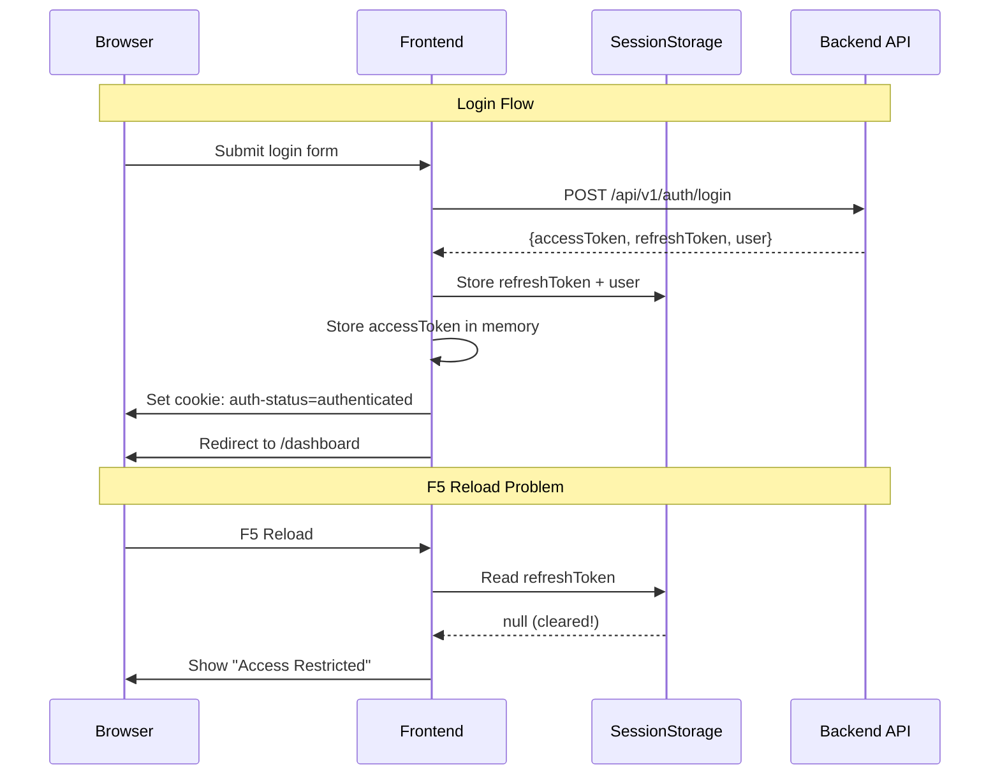
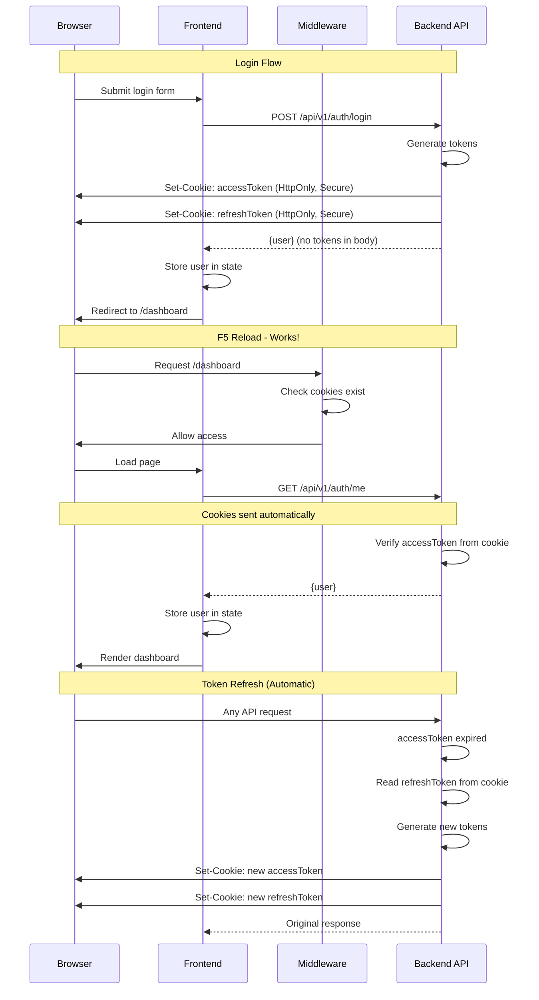

# HttpOnly Cookie Authentication Migration Plan

## Executive Summary

Migrate from client-side token storage (sessionStorage) to HttpOnly cookie-based authentication to fix the F5 reload issue and improve security.

**Current Problem:** After F5 reload, `sessionStorage` loses the refresh token, causing authentication to fail and showing "Access Restricted" errors.

**Solution:** Store tokens in HttpOnly cookies (backend-managed) instead of client-side storage.

---

## Current Authentication Flow Analysis

### Current Architecture



### Current Touchpoints

1. **[`stores/auth.store.ts`](stores/auth.store.ts:23-87)**
   - Uses Zustand with `sessionStorage` persistence
   - Stores: `refreshToken`, `user` (persisted), `accessToken` (memory only)
   - Sets `auth-status` cookie for middleware

2. **[`lib/api/client.ts`](lib/api/client.ts:228-277)**
   - Injects `Authorization: Bearer {accessToken}` header
   - Handles 401 by calling `onTokenRefresh()`
   - Token refresh uses stored `refreshToken` from sessionStorage

3. **[`components/providers/auth-initializer.tsx`](components/providers/auth-initializer.tsx:7-46)**
   - Runs on app startup
   - Attempts silent token refresh if `refreshToken` exists
   - Fetches user profile after refresh

4. **[`middleware.ts`](middleware.ts:1-36)**
   - Checks `auth-status` cookie
   - Redirects unauthenticated users to `/login`

5. **Auth Endpoints**
   - `POST /api/v1/auth/login` - Returns tokens + user
   - `POST /api/v1/auth/refresh` - Exchanges refresh token for new tokens
   - `POST /api/v1/auth/logout` - Invalidates session
   - `GET /api/v1/auth/me` - Returns current user

---

## Proposed HttpOnly Cookie Architecture

### New Flow



### Key Changes

1. **Tokens stored in HttpOnly cookies** (not accessible to JavaScript)
2. **Frontend never handles tokens** (browser sends automatically)
3. **Backend manages token lifecycle** (refresh, rotation, expiry)
4. **Middleware checks cookie presence** (not cookie value)
5. **User profile stored in client state** (for UI display)

---

## Backend API Changes Required

### 1. Update Login Endpoint

**Current Response:**
```json
{
  "data": {
    "accessToken": "eyJhbGc...",
    "refreshToken": "eyJhbGc...",
    "user": { "id": "...", "email": "...", "roles": [...] }
  }
}
```

**New Response:**
```json
{
  "data": {
    "user": { "id": "...", "email": "...", "roles": [...] }
  }
}
```

**New Headers:**
```
Set-Cookie: accessToken=eyJhbGc...; HttpOnly; Secure; SameSite=Lax; Path=/; Max-Age=900
Set-Cookie: refreshToken=eyJhbGc...; HttpOnly; Secure; SameSite=Lax; Path=/; Max-Age=604800
```

**Implementation:**
```typescript
// Backend: POST /api/v1/auth/login
async login(req, res) {
  const { email, password, tenantSlug } = req.body;
  
  // Authenticate user
  const { accessToken, refreshToken, user } = await authService.login(email, password, tenantSlug);
  
  // Set HttpOnly cookies
  res.cookie('accessToken', accessToken, {
    httpOnly: true,
    secure: process.env.NODE_ENV === 'production',
    sameSite: 'lax',
    path: '/',
    maxAge: 15 * 60 * 1000, // 15 minutes
  });
  
  res.cookie('refreshToken', refreshToken, {
    httpOnly: true,
    secure: process.env.NODE_ENV === 'production',
    sameSite: 'lax',
    path: '/',
    maxAge: 7 * 24 * 60 * 60 * 1000, // 7 days
  });
  
  // Return only user data
  return res.json({ data: { user } });
}
```

### 2. Update Refresh Endpoint

**Current Request:**
```json
POST /api/v1/auth/refresh
{
  "refreshToken": "eyJhbGc..."
}
```

**New Request:**
```
POST /api/v1/auth/refresh
Cookie: refreshToken=eyJhbGc...
```

**Implementation:**
```typescript
// Backend: POST /api/v1/auth/refresh
async refresh(req, res) {
  const refreshToken = req.cookies.refreshToken;
  
  if (!refreshToken) {
    return res.status(401).json({ error: { message: 'No refresh token' } });
  }
  
  // Generate new tokens
  const { accessToken: newAccessToken, refreshToken: newRefreshToken } = 
    await authService.refresh(refreshToken);
  
  // Set new cookies
  res.cookie('accessToken', newAccessToken, {
    httpOnly: true,
    secure: process.env.NODE_ENV === 'production',
    sameSite: 'lax',
    path: '/',
    maxAge: 15 * 60 * 1000,
  });
  
  res.cookie('refreshToken', newRefreshToken, {
    httpOnly: true,
    secure: process.env.NODE_ENV === 'production',
    sameSite: 'lax',
    path: '/',
    maxAge: 7 * 24 * 60 * 60 * 1000,
  });
  
  return res.json({ data: { success: true } });
}
```

### 3. Update Logout Endpoint

**Implementation:**
```typescript
// Backend: POST /api/v1/auth/logout
async logout(req, res) {
  const refreshToken = req.cookies.refreshToken;
  
  // Invalidate refresh token in database
  if (refreshToken) {
    await authService.revokeRefreshToken(refreshToken);
  }
  
  // Clear cookies
  res.clearCookie('accessToken', { path: '/' });
  res.clearCookie('refreshToken', { path: '/' });
  
  return res.json({ data: { success: true } });
}
```

### 4. Update Authentication Middleware

**Implementation:**
```typescript
// Backend: Authentication middleware
async function authenticate(req, res, next) {
  const accessToken = req.cookies.accessToken;
  
  if (!accessToken) {
    return res.status(401).json({ error: { message: 'Not authenticated' } });
  }
  
  try {
    const payload = await verifyToken(accessToken);
    req.user = payload;
    next();
  } catch (error) {
    // Token expired or invalid
    return res.status(401).json({ error: { message: 'Invalid token' } });
  }
}
```

### 5. Update Register Endpoint

Same changes as login - set cookies instead of returning tokens in body.

---

## Frontend Changes Required

### 1. Update Auth Store

**File:** [`stores/auth.store.ts`](stores/auth.store.ts)

**Changes:**
- Remove `accessToken` and `refreshToken` from state
- Remove persistence (no need for sessionStorage)
- Keep `user` in memory state only
- Remove cookie management (backend handles it)

```typescript
interface AuthState {
  // State
  user: AuthUser | null
  isInitialized: boolean

  // Computed
  isAuthenticated: boolean

  // Actions
  login: (user: AuthUser) => void
  setUser: (user: AuthUser) => void
  logout: () => void
  setInitialized: (value: boolean) => void
}

export const useAuthStore = create<AuthState>()((set, get) => ({
  user: null,
  isInitialized: false,

  get isAuthenticated() {
    return !!get().user
  },

  login: (user) => {
    set({ user })
  },

  setUser: (user) => {
    set({ user })
  },

  logout: () => {
    set({ user: null })
  },

  setInitialized: (value) => {
    set({ isInitialized: value })
  },
}))
```

### 2. Update API Client

**File:** [`lib/api/client.ts`](lib/api/client.ts)

**Changes:**
- Remove token injection (cookies sent automatically)
- Remove `getAccessToken` and `getTenantId` from config
- Update `onTokenRefresh` to call refresh endpoint
- Enable credentials for cookie support

```typescript
class ApiClient {
  private readonly baseUrl: string
  private readonly onAuthError: () => void

  constructor(config: { baseUrl: string; onAuthError: () => void }) {
    this.baseUrl = config.baseUrl
    this.onAuthError = config.onAuthError
  }

  async request<T>(endpoint: string, options: RequestOptions = {}): Promise<T> {
    const url = this.buildUrl(endpoint, options.params)

    const headers: Record<string, string> = {
      'Content-Type': 'application/json',
      ...options.headers,
    }

    const fetchOptions: RequestInit = {
      method: options.method ?? 'GET',
      headers,
      body: options.body !== undefined ? JSON.stringify(options.body) : undefined,
      credentials: 'include', // Send cookies with requests
    }

    let response = await fetch(url, fetchOptions)

    // Handle 401 — attempt token refresh once
    if (response.status === 401) {
      const refreshed = await this.attemptRefresh()
      if (refreshed) {
        response = await fetch(url, fetchOptions)
      } else {
        this.onAuthError()
        throw new ApiError('Session expired. Please log in again.', 401, 'SESSION_EXPIRED')
      }
    }

    return this.handleResponse<T>(response)
  }

  private async attemptRefresh(): Promise<boolean> {
    try {
      const response = await fetch(`${this.baseUrl}/api/v1/auth/refresh`, {
        method: 'POST',
        credentials: 'include',
      })
      return response.ok
    } catch {
      return false
    }
  }

  // ... rest of methods
}

export const apiClient = new ApiClient({
  baseUrl: process.env.NEXT_PUBLIC_API_URL ?? 'http://localhost:3000',
  onAuthError: () => {
    const state = getAuthStore()
    state.logout?.()
    if (typeof window !== 'undefined') {
      window.location.href = '/login'
    }
  },
})
```

### 3. Update Auth Service

**File:** [`lib/api/services/auth.service.ts`](lib/api/services/auth.service.ts)

**Changes:**
- Update type signatures (no tokens in responses)

```typescript
export const authService = {
  login: (data: LoginRequest): Promise<{ user: AuthUser }> =>
    apiClient.post<{ user: AuthUser }>(ENDPOINTS.auth.login, data),

  register: (data: RegisterRequest): Promise<{ user: AuthUser }> =>
    apiClient.post<{ user: AuthUser }>(ENDPOINTS.auth.register, data),

  refresh: (): Promise<{ success: boolean }> =>
    apiClient.post<{ success: boolean }>(ENDPOINTS.auth.refresh),

  logout: (): Promise<{ success: boolean }> =>
    apiClient.post<{ success: boolean }>(ENDPOINTS.auth.logout),

  getMe: (): Promise<AuthUser> =>
    apiClient.get<AuthUser>(ENDPOINTS.auth.me),
}
```

### 4. Update Auth Types

**File:** [`types/auth.ts`](types/auth.ts)

```typescript
// Remove tokens from response types
export interface AuthResponse {
  user: AuthUser
}

// Remove TokensResponse (no longer needed)
```

### 5. Update Login Hook

**File:** [`features/auth/hooks/use-login.ts`](features/auth/hooks/use-login.ts)

```typescript
export function useLogin(callbackUrl = '/dashboard') {
  const router = useRouter()
  const { login } = useAuthStore()
  const { setTenant } = useTenantStore()

  return useMutation({
    mutationFn: (data: LoginRequest) => authService.login(data),
    onSuccess: (response) => {
      // Store only user (cookies set by backend)
      login(response.user)

      // Persist tenant context
      setTenant(response.user.tenantId, '', '')

      toast.success('Welcome back!', {
        description: `Signed in as ${response.user.firstName} ${response.user.lastName}`,
      })

      router.push(callbackUrl)
    },
    onError: (err) => {
      toast.error('Sign in failed', {
        description: err instanceof Error ? err.message : 'Invalid credentials.',
      })
    },
  })
}
```

### 6. Update Auth Initializer

**File:** [`components/providers/auth-initializer.tsx`](components/providers/auth-initializer.tsx)

```typescript
export function AuthInitializer({ children }: { children: React.ReactNode }) {
  const { setUser, logout, setInitialized, isInitialized } = useAuthStore()

  useEffect(() => {
    async function initialize() {
      try {
        // Fetch current user (cookies sent automatically)
        const user = await authService.getMe()
        setUser(user)
      } catch {
        // Not authenticated or session expired
        logout()
      } finally {
        setInitialized(true)
      }
    }

    initialize()
  }, []) // eslint-disable-line react-hooks/exhaustive-deps

  if (!isInitialized) {
    return (
      <div className="flex min-h-screen items-center justify-center">
        <div className="h-8 w-8 animate-spin rounded-full border-4 border-primary border-t-transparent" />
      </div>
    )
  }

  return <>{children}</>
}
```

### 7. Update Middleware

**File:** [`middleware.ts`](middleware.ts)

**Changes:**
- Check for `accessToken` or `refreshToken` cookie presence
- Remove `auth-status` cookie check

```typescript
export function middleware(request: NextRequest) {
  const { pathname } = request.nextUrl
  const hasAccessToken = request.cookies.has('accessToken')
  const hasRefreshToken = request.cookies.has('refreshToken')
  const isAuthenticated = hasAccessToken || hasRefreshToken

  // Allow public routes
  if (PUBLIC_ROUTES.some((route) => pathname.startsWith(route))) {
    if (isAuthenticated) {
      return NextResponse.redirect(new URL('/dashboard', request.url))
    }
    return NextResponse.next()
  }

  // Protect all other routes
  if (!isAuthenticated) {
    const loginUrl = new URL('/login', request.url)
    loginUrl.searchParams.set('callbackUrl', pathname)
    return NextResponse.redirect(loginUrl)
  }

  return NextResponse.next()
}
```

### 8. Update Logout Hook

**File:** [`features/auth/hooks/use-logout.ts`](features/auth/hooks/use-logout.ts)

```typescript
export function useLogout() {
  const router = useRouter()
  const queryClient = useQueryClient()
  const { logout } = useAuthStore()
  const { clearTenant } = useTenantStore()

  return useMutation({
    mutationFn: () => authService.logout(),
    onSettled: () => {
      // Clear local state (cookies cleared by backend)
      logout()
      clearTenant()
      queryClient.clear()
      toast.success('Signed out successfully')
      router.push('/login')
    },
  })
}
```

---

## Security Improvements

### Before (Current)

| Aspect | Status | Risk |
|--------|--------|------|
| Token storage | `sessionStorage` | ⚠️ Accessible to JavaScript (XSS risk) |
| Token transmission | Request body | ⚠️ Visible in network logs |
| Token persistence | Lost on reload | ❌ Poor UX |
| CSRF protection | None | ⚠️ Vulnerable |

### After (HttpOnly Cookies)

| Aspect | Status | Risk |
|--------|--------|------|
| Token storage | HttpOnly cookies | ✅ Not accessible to JavaScript |
| Token transmission | Cookie header | ✅ Automatic, secure |
| Token persistence | Survives reload | ✅ Great UX |
| CSRF protection | SameSite=Lax | ✅ Protected |

### Additional Security Measures

1. **Secure flag** - Cookies only sent over HTTPS in production
2. **SameSite=Lax** - Prevents CSRF attacks
3. **HttpOnly** - Prevents XSS token theft
4. **Short-lived access tokens** - 15 minutes (reduces exposure window)
5. **Refresh token rotation** - New refresh token on each refresh
6. **Token revocation** - Backend can invalidate tokens

---

## Migration Strategy

### Phase 1: Backend Implementation

1. Add cookie-parser middleware
2. Update login endpoint to set cookies
3. Update refresh endpoint to read/set cookies
4. Update logout endpoint to clear cookies
5. Update auth middleware to read from cookies
6. Test all endpoints with Postman/curl

### Phase 2: Frontend Implementation

1. Update auth store (remove token state)
2. Update API client (add credentials: 'include')
3. Update auth service types
4. Update login/logout hooks
5. Update auth initializer
6. Update middleware
7. Remove diagnostic logs

### Phase 3: Testing

1. Test login flow
2. Test F5 reload (should work!)
3. Test logout flow
4. Test token refresh
5. Test session expiry
6. Test CSRF protection
7. Test across browsers

### Phase 4: Deployment

1. Deploy backend changes
2. Deploy frontend changes
3. Monitor error logs
4. Clear user sessions (force re-login)

---

## Rollback Plan

If issues arise:

1. **Backend:** Revert to returning tokens in response body
2. **Frontend:** Revert to sessionStorage (but change to localStorage to fix reload issue)
3. **Quick fix:** Change line 79 in [`stores/auth.store.ts`](stores/auth.store.ts:79) from `sessionStorage` to `localStorage`

---

## Testing Checklist

### Backend Tests

- [ ] Login sets `accessToken` and `refreshToken` cookies
- [ ] Cookies have correct flags (HttpOnly, Secure, SameSite)
- [ ] Refresh endpoint reads cookie and sets new cookies
- [ ] Logout clears cookies
- [ ] Auth middleware validates cookie tokens
- [ ] 401 returned when cookies missing/invalid

### Frontend Tests

- [ ] Login stores user in state
- [ ] F5 reload maintains authentication
- [ ] Dashboard shows correct user info after reload
- [ ] Tenants page accessible to super admin after reload
- [ ] Users page accessible to admins after reload
- [ ] Logout clears user state
- [ ] Expired session redirects to login
- [ ] Token refresh happens automatically on 401

### Security Tests

- [ ] Cookies not accessible via `document.cookie`
- [ ] Cookies only sent to same origin
- [ ] CSRF attacks blocked by SameSite
- [ ] XSS cannot steal tokens
- [ ] Tokens not visible in browser DevTools storage

---

## Environment Variables

### Backend

```env
# Cookie settings
COOKIE_SECURE=true  # Set to false in development
COOKIE_DOMAIN=.yourdomain.com  # For subdomain sharing
```

### Frontend

```env
# API URL must match cookie domain
NEXT_PUBLIC_API_URL=https://api.yourdomain.com
```

---

## Next Steps

1. Review this plan with the team
2. Estimate implementation time
3. Create backend implementation tasks
4. Create frontend implementation tasks
5. Schedule deployment window
6. Prepare rollback procedure
